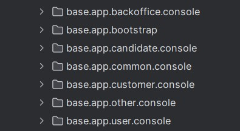

# US G003

## 1. Context

For efficient software development, it is necessary to set up the project structure to facilitate and speed up the development of future user stories.
This task is crucial to ensure that the team will not face difficulties in implementing features in the future.

## 2. Requirements

**US G003** As Project Manager, I want the team to configure the project structure to facilitate / accelerate the development of upcoming user stories.

**Acceptance Criteria:**

- The project configuration must allow for continuous integration and development, supporting test practices, and continuous integration.

**Dependencies/References:**

* Define the structure of the project to support the envisioned architecture, such as presented in Chapter 4, including support for adopted technologies (e.g., ANTLR).

## 3. Relevance

* Configuring the project structure is important to ensure and speed up the development of upcoming user stories, thereby ensuring productivity and project success.
* With a well-organized and optimized structure, developers can focus on implementing functionalities consciously and efficiently, and easily incorporate essential processes such as testing and deployment.

## 4. Implementation

The implementation will involve creating the directory structure as per the EAPLI course base project, configure build and tests tools.

## 5. Integration/Demonstration

* The project structure will be maintained throughout the development process to ensure consistency and integration.
* Demonstrate the effectiveness of the project structure through a series of automated builds and integration tests. 
* Provide guides and scripts that facilitate the execution of tests and the demonstration of functionalities.

The image above shows the project structure that will be used in the development of the project. 
The project will be divided into three main packages:
- **src/main/java**:This directory contains the application's java classes.
- **src/test/java**: This directory contains the unit tests for the applications.
- **target**: This directory is generated by maven and contains the compiled classes and the packaged jar file.
- **pom.xml**: This file contains the project's dependencies and configurations.

The project presents various packages as illustrated in the image below:

- The jobs4u.util.ci package is responsible for managing Continuous Integration (CI) configuration files and scripts within the application. It includes setup scripts, and any other utilities necessary for automating the build, test, and deployment processes of the application.