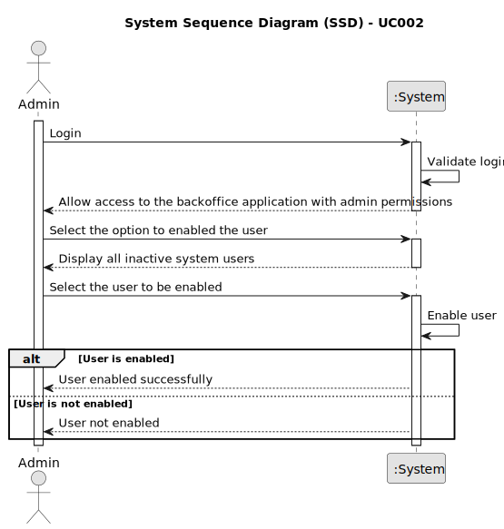

# UC002 - As Admin, I want to enable users of the backoffice

## 1. Requirements Engineering

### 1.1. Use Case Description

> As Administrator, I want to be able to enable users of the backoffice.

---

### 1.2. Customer Specifications and Clarifications

**From the specifications document:**

- The administrator can perform operations such as registering, disabling/enabling and listing backoffice users, which includes roles such as customer manager, language engineer, and operator.
- Only inactive users can be enabled.
- The system must display the user information in a table format so the admin can choose the user to be enabled.
- After a user is enabled, the system must display a message informing the admin that the user was successfully enabled.
- Enabled users can log in the system.

**From the client clarifications:**

> **Question:** Can a user (from the backoffice, for example) be enabled/disabled multiple times?
>
> **Answer:** Yes.

> **Question:** Regarding user registration, should all of these be considered "enable" by default, or should there be an option to "enable/disable" users during the registration process?
> 
> **Answer:** I assume they must be active by default.

> **Question:** Does the change of status refer to the candidate or the individual application and how does it relate to enabling/disabling users?
> 
> **Answer:** User enable/disable is only to control access to the system.
The status, in the application process, is the status of a candidate's application for a job opening, it is not directly related to the enable/disable of users.

--- 

### 1.3. Acceptance Criteria

> AC002.1: The admin must have an option to enable system users.
> 
> AC002.2: Only inactive users can be enabled.
> 
> AC002.3: The system must display the user information in a table format so the admin can choose the user to be enabled.
> 
> AC002.4: After a user is enabled, he/she must be able to log in the system. 

---

### 1.4. Found out Dependencies

* This Use Case is relative to US 1000, which is related to the backoffice users management functionality.
* It relates to the following Use Cases as well:
  - [UC001](../../UC001/README.md) - As Admin, I want to be able to register users of the backoffice.
  - [UC003](../../UC003/README.md) - As Admin, I want to be able to disable users of the backoffice.
  - [UC004](../../UC004/README.md) - As Admin, I want to be able to list users of the backoffice.

### 1.5 Input and Output Data

**Input Data:**
- Selected data:
  - User to be enabled

**Output Data:**
- Inactive users of the system

### 1.6. System Sequence Diagram (SSD)

### 1.7 Other Relevant Remarks

- As said earlier, the user management functionality depends on the system's ability to authenticate users and manage roles appropriately.