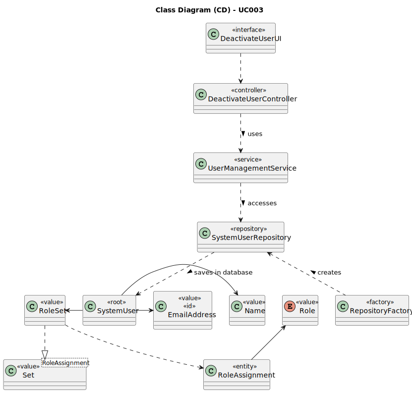

# UC003 - As Admin, I want to disable users of the backoffice

## 3. Design - Use Case Realization

### 3.1. Rationale

| Interaction ID                                                            | Question: Which class is responsible for...            | Answer                          | Justification (with patterns)                                                                                                                               |
|:--------------------------------------------------------------------------|:-------------------------------------------------------|:--------------------------------|:------------------------------------------------------------------------------------------------------------------------------------------------------------|
| Step 1: Login (as Admin)                                                  | ... running the application's console?                 | BaseApplication                 | Pure Fabrication: BaseApplication is a class created with the purpose of running a console in our application.                                              |
|                                                                           | ... showing the backoffice console to do login?        | BaseBackoffice                  | Pure Fabrication: BaseBackoffice is a class created with the purpose of showing the backoffice console.                                                     |
|                                                                           | ... showing the login menu?                            | LoginUI                         | Pure Fabrication: LoginUI is a class created with the purpose of showing the login menu.                                                                    |
| Step 2: Validate login (as Admin)                                         | ... validating the login credentials?                  | AuthenticationCredentialHandler | Service: AuthenticationCredentialHandler is a class that provides the service of validating login credentials.                                              |
|                                                                           | ... showing the login (in)success message?             | LoginUI                         | Pure Fabrication: LoginUI is a class created with the purpose of showing the login success message.                                                         |
| Step 3: Allow access to the backoffice application with admin permissions | ... giving admin permissions to logged user?           | AuthenticationCredentialHandler | Service: AuthenticationCredentialHandler is a class that provides the service of validating login credentials.                                              |
| Step 4: Select the option to list all backoffice users                    | ... interacting with the admin?                        | MainMenu                        | Pure Fabrication: MainMenu is a class created with the purpose of redirecting to the specific UI's.                                                         |
| Step 5: List active users                                                 | ... showing all active users?                          | DeactivateUserUI                | Pure Fabrication: DeactivateUserUI is a class created with the purpose of interacting with the user in this use case.                                       |
|                                                                           | ... controlling the flow of the use case?              | DeactivateUserController        | Controller: DeactivateUserController is a class created with the purpose of controlling the flow of the use case.                                           |
|                                                                           | ... knowing all existing users?                        | SystemUserRepository            | Information Expert: SystemUserRepository is a class created with the purpose of accessing user's repository in the database to know all instances of users. |
|                                                                           | ... knowing the user's name?                           | SystemUser                      | Information Expert: SystemUser knows all its details.                                                                                                       |
|                                                                           | ... knowing the user's email?                          | SystemUser                      | Information Expert: SystemUser knows all its details.                                                                                                       |
|                                                                           | ... filter user's according to their status?           | UserManagementService           | Service: UserManagementService is a class that provides the service of filtering users according to their status.                                           |
| Step 6: Select user to be disabled                                        | ... interacting with the admin?                        | DeactivateUserUI                | Pure Fabrication: DeactivateUserUI is a class created with the purpose of interacting with the user in this use case.                                       |
|                                                                           | ... know the user to be disabled?                      | SystemUserRepository            | Information Expert: SystemUserRepository is a class created with the purpose of accessing user's repository in the database to know all instances of users. |
| Step 7: Deactivate user                                                   | ... know if the user is active (liable to be disabled) | SystemUser                      | InformationExpert: SystemUser know all its details.                                                                                                         |
|                                                                           | ... deactivate the user?                               | UserManagementService           | Service: UserManagementService is a class that provides the service of deactivating users.                                                                  |

### Systematization ##

According to the taken rationale, the conceptual classes promoted to software classes are:

* SystemUser
* Name
* EmailAddress

Other software classes (i.e. Pure Fabrication) identified:

* LoginUI
* AuthenticationCredentialHandler
* MainMenu
* DeactivateUserUI
* DeactivateUserController
* SystemUserRepository
* UserManagementService

## 3.2. Sequence Diagram (SD)

## 3.3. Class Diagram (CD)

