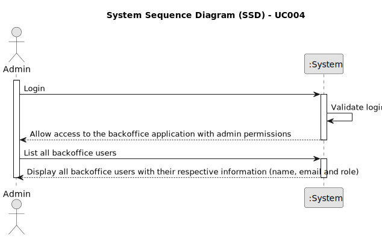

# UC004 - As Admin, I want to list users of the backoffice

## 1. Requirements Engineering

### 1.1. Use Case Description

> As Administrator, I want to be able to list users of the backoffice.

---

### 1.2. Customer Specifications and Clarifications

**From the specifications document:**

- The administrator can perform operations such as registering, disabling/enabling and listing backoffice users, which includes roles such as customer manager, language engineer, and operator.
- To list users, the administrator must be able to see the name, email, and role of each user.

**From the client clarifications:** there were no questions regarding this use case.

--- 

### 1.3. Acceptance Criteria

> AC004.1: All user information must appear when the admin lists the users of the backoffice.
>
> AC004.2: The user information must include the name, email, and role of each user.
> 
> AC004.3: The user information must be displayed in a table format.
> 
> AC004.4: The user information must be displayed in a way that is easy to read and understand.
> 
> AC004.5: Only backoffice users must be listed.

---

### 1.4. Found out Dependencies

* This Use Case is relative to US 1000, which is related to the backoffice users management functionality.
* It relates to the following Use Cases as well:
  - [UC001](../../UC001/README.md) - As Admin, I want to be able to register users of the backoffice.
  - [UC002](../../UC002/README.md) - As Admin, I want to be able to enable users of the backoffice.
  - [UC003](../../UC003/README.md) - As Admin, I want to be able to disable users of the backoffice.

### 1.5 Input and Output Data

**Input Data:** none

**Output Data:**
- Name of the user
- Email of the user
- Role of the user

### 1.6. System Sequence Diagram (SSD)

### 1.7 Other Relevant Remarks

- As said earlier, the user management functionality depends on the system's ability to authenticate users and manage roles appropriately.