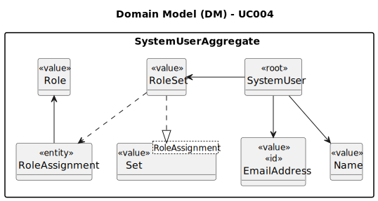

# UC004 - As Admin, I want to list users of the backoffice

## 2. Analysis

### 2.1. Relevant Domain Model Excerpt

The following diagram was extracted from the EAPLI framework (provided by the course's teachers).

### 2.2. Process Specification

#### 2.2.1. Normal Flow
1. **Authenticate Admin**: Verify that the Admin is logged in with appropriate permissions.
2. **Access User Management Interface**: Admin navigates to the user management section of the backoffice.
3. **Select List Active Backoffice Users Option**: Admin selects the option to list active backoffice users.
4. **Retrieve and Display User Data**: The system retrieves and displays a list of active backoffice users.

#### 2.2.2. Exceptional Flows
- **EF004.1**: If there is no data, the system shall display a message indicating that there are no users to list.
- **EF004.2**: If there is an error retrieving the data, the system shall display an error message and prompt the Admin to try again later.

### 2.3. Functional Requirements Reevaluation
- **FR004.1**: The system shall allow the Admin to list active backoffice users, showing their name, email and role(s).
- **FR004.2**: The system shall display a message indicating that there are no users to list if there is no data.
- **FR004.3**: The system shall display an error message if there is an error retrieving the data.
- **FR004.4**: The system shall filter users by active and with backoffice role(s).

### 2.4. Non-functional Requirements Specification
- **Security**: Assess encryption standards for transmitting user credentials.
- **Performance**: Ensure user listing processes complete within acceptable time limits, maintaining system responsiveness.
- **Usability**: Interface should be intuitive, guiding the Admin smoothly through the listing process with clear instructions and error handling.

### 2.5. Data Integrity and Security
- **Authorized Access**: Ensure that user data is stored securely and that only authorized users can access it.

### 2.6. Interface Design
- The interface will follow the EAPLI framework's design patterns, providing a user-friendly experience for the Admin.

### 2.7. Risk Analysis
- **R004.1**: Unauthorized Access to User Data
    - **Mitigation**: Implement validation checks within the system to ensure that only admin can list active backoffice users.

### 2.8. Decisions
- **D004.1**: Utilize role-based access control for user management, assigning to each user specific permissions based on their role.