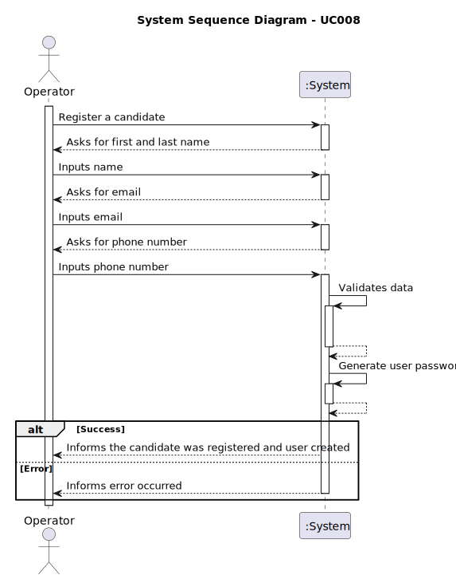

# UC 008 - As Operator, register a candidate.

## 1. Requirements Engineering

### 1.1. User Story Description

As an operator, I want to register a candidate and create a corresponding user.

### 1.2. Customer Specifications and Clarifications

**From the specifications document:**

> None

**From the client clarifications:**

> **Question:** Na criação de um utilizador no sistema o nome é definido pelo utilizador ou é o nome da pessoa (primeiro
> e último) e se a password é definida pelo utilizador ou gerada pelo sistema?

> **Answer:** No âmbito da US 2000a o Operator cria utilizadores do sistema para candidatos que ainda não estejam no
> sistema. Tem de fazer isso com base nos dados recebidos na candidatura (que incluem email e nome). O email servirá
> para
> identificar a pessoa. Neste contexto é necessário ter uma password para esse novo utilizador. Uma vez que essa
> informação não é transmitida pelo candidato, suponho que a solução mais “aconselhada” será o sistema gerar uma
> password
> para esse utilizador. Como o utilizador/candidato irá receber essa informação (a forma de autenticação na app) está
> out
> of scope, no sentido em que não existe nenhuma US que remete para isso. As US 1000 e 1001 também remetem para criação
> de
> utilizadores. Aqui, eventualmente poderia-se pensar em introduzir manualmente as passwords, mas pode ser pelo mesmo
> mecanismo de definição automática de password, descrito anteriormente.

> **Question:** Regarding the US2000a requirement which states "As an Operator, I want to register a candidate and
> create a corresponding user," I would like to know how a candidate will be registered in the system, i.e., understand
> the processes for registering a candidate. Since the candidate has their name, email, and phone number, how should
> their
> username be formatted to avoid conflicts with other candidates' names? Additionally, how should the candidate be
> notified of their username and password?

> **Answer:** There is no need for a user name. Regarding the password, I think the system can generate a
> unique password. You may assume the candidate will be informed of his/her password by means that are outside of the
> scope of what is to be developed for this version of the system

> **Question:** Relativamente ao registo dos candidatos, os dados devem ser inseridos manualmente ou importados do
> ficheiro com os dados do candidato?

> **Answer:** A US2000a refere-se a uma funcionalidade do Operador, manualmente, registar candidatos.

> **Question:** The operator can register a candidate: does he put the info manually or has to be read of the file
> generated by the bot? This user will appear then in the backoffice...enable as default I think. Then the admin, can
> also
> register manually a candidate as the operator did it? I don't understand at all the different between a registration
> of
> the candidate made by the admin or made by the operator.

> **Answer:** US2000a is for the Operator to manually register a candidate and his/her user in the system.

> **Question:** I was thinking about if the candidate could change his/her email. In older questions you said the email
> was the identificator of the candidate, isn't it? Should we put another id made by sequence numbers or by his NIF, for
> example, to identificate him/her in the system? Could we say the same for the user who is managing the app of the
> customer?

> **Answer:** The field/data that identifies the user in the system is always the email (it must be unique). For the
> moment there is no need for supporting the possibility of changing the email or add any other identification
> possibility.

> **Question:**

> **Answer:**
### 1.3 Functional Requirements

* FR1: The operator must be able to input candidate's personal information, including:
    * First and last name
    * Email address (used as a unique identifier)
    * Phone number
* FR2: The system must validate the email address to ensure it is in the correct format and does not yet exist in
  the database.
* FR3: The system must validate the first and last name and the phone number to ensure they are in the correct format.
* FR4: Upon successful validation, the system should automatically generate a password linked to the candidate's
  email.
* FR5: The system must store the user's information in the database.
* FR6: The system must provide feedback to the operator upon successful/unsuccessful registration.

### 1.4 Non-Functional Requirements

* NFR1: The interface for registering candidates should be user-friendly and efficient, minimizing the time and effort
  required by the operator.
* NFR2: Security: All personal information and user credentials must be securely handled and stored.

### 1.3. Acceptance Criteria

* **AC1:** The operator must be able to input the candidate's personal information, including first and last name, email
  address, and phone number.
* **AC2:** The system must validate the email address to ensure it is in the correct format and does not yet exist in
  the database.
* **AC3:** The system must validate the first and last name and the phone number to ensure they are in the correct
  format.
* **AC4:** Upon successful validation, the system should automatically generate a password linked to the candidate's
  email.
* **AC5:** The system must store the user's information in the database.
* **AC6:** The system must provide feedback to the operator upon successful/unsuccessful registration.

### 1.4. Found out Dependencies

* None

### 1.5 Input and Output Data

**Input Data:**

* Typed data:
    * First and last name
    * Email address
    * Phone number

* Selected data:
    * Role

**Output Data:**

* Feedback message

### 1.6. System Sequence Diagram (SSD)

#

### 1.7 Other Relevant Remarks

* None
