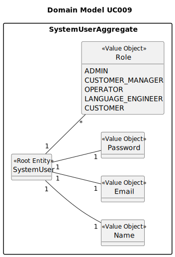

# UC008 - As Operator, register a candidate.

## 2. Analysis

### 2.1. Relevant Domain Model Excerpt

The following diagram was extracted from the EAPLI framework (provided by the course's teachers):

### 2.2. Process Specification

#### 2.2.1. Normal Flow
1. **Authenticate Operator**: Ensure that the user attempting to register a candidate is authenticated as an operator.
2. **Input Candidate Details**: The operator enters the candidate's details such as name, email, and any other required information specified in the user story.
3. **Validate Input Data**: The system checks that all required fields are filled and validates them according to predefined rules (e.g., email format).
4. **Save Candidate Data**: If validation passes, the system saves the candidate information to the database.
5. **Confirmation**: The system confirms to the operator that the candidate has been successfully registered.

#### 2.2.2. Exceptional Flows
- **EF002.1**: If there is no data, the system shall display a message indicating that there are no users to list.
- **EF002.2**: If there is an error retrieving the data, the system shall display an error message and prompt the Admin to try again later.
- **EF002.3**: If the validation fails (e.g., missing required fields, invalid email), the system prompts the operator to correct the input.

### 2.3. Functional Requirements Reevaluation
- **FR002.4**: The system shall enable the selected user.
- **FR002.5**: The system must validate the candidate's data against business rules before registration.
- **FR002.6**: The system should provide a user-friendly mechanism for operators to enter candidate data.

### 2.4. Non-functional Requirements Specification
- **Security**: Assess encryption standards for transmitting user credentials and storing sensitive data.
- **Performance**: Ensure candidate registration processes are optimized for efficiency, especially when handling large volumes of data.
- **Usability**: The interface should be intuitive, guiding the Operator smoothly through the registration process with clear instructions and effective error handling.

### 2.5. Data Integrity and Security
- **Authorized Access**: Ensure that candidate data is stored securely and that only authorized operators can access or modify it.
- **Data Validation**: Implement strict validation rules to maintain the integrity of the data entered into the system.

### 2.6. Interface Design
- The interface will follow the EAPLI framework's design patterns, providing a user-friendly experience for the Operator.
- Ensure the form for entering candidate details is clear, with labels and input validation feedback.

### 2.7. Risk Analysis
- **R003.1**: Unauthorized Access to User Data
    - **Mitigation**: Implement validation checks within the system to ensure that only authorized operators can register candidates.
- **R003.2**: Data Entry Errors
    - **Mitigation**: Use real-time validation to guide operators through correct data entry and prevent common mistakes.

### 2.8. Decisions
- **D003.1**: Utilize role-based access control for user management, assigning to each user specific permissions based on their role.
- **D003.2**: Decide on the specific technologies and frameworks for implementing the frontend input forms and backend services based on existing infrastructure and best practices in the industry.
