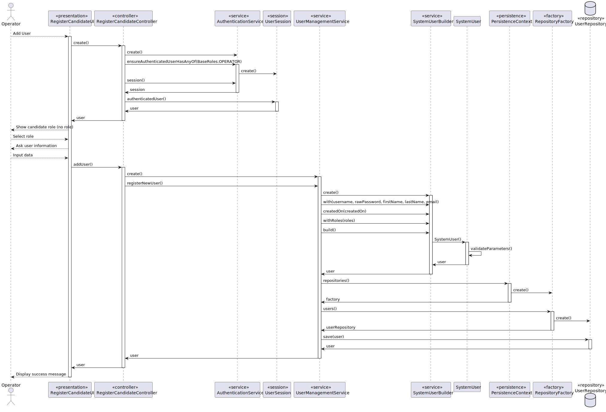
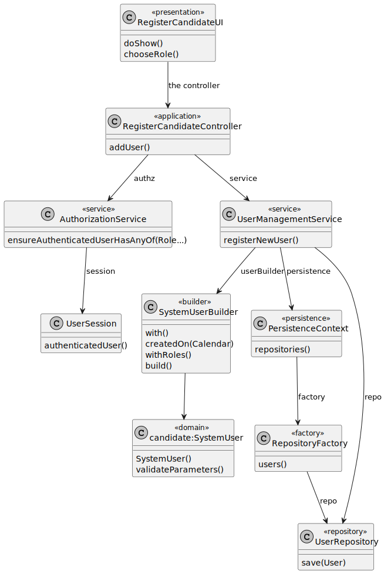

# UC 008 — As Operator, register a candidate.

## 3. Design - User Story Realization

### 3.1. Rationale

| Interaction ID                        | Question: Which class is responsible for... | Answer                | Justification (with patterns)                                                                                 |
|:--------------------------------------|:--------------------------------------------|:----------------------|:--------------------------------------------------------------------------------------------------------------|
| Step 1 : asks to register a candidate | interacting with the actor?                 | AddUserUI             | Pure Fabrication: there is no reason to assign this responsibility to any existing class in the Domain Model. |
|                                       | coordinating the US?                        | AddUserController     | Controller                                                                                                    |
|                                       | instantiating a new SystemUser?             | UserManagementService | Creator                                                                                                       |
|                                       | knowing the user using the system?          | UserSession           | IE: cf. A&A component documentation.                                                                          |
|                                       |                                             | UserRepository        | IE: knows/has its own users                                                                                   |
|                                       |                                             | SystemUser            | IE: knows its own data                                                                                        |
| Step 2 : requests data                |                                             |                       |                                                                                                               |
| Step 3 : types requested data         | validating all data (local validation)?     | SystemUser            | IE: owns its data.                                                                                            |
|                                       | validating all data (global validation)?    | UserRepository        | IE: knows all its users.                                                                                      |
|                                       | saving the created announcement?            | UserRepository        | IE: owns all its users.                                                                                       |
|                                       | saving the registered user?                 | UserRepository        | IE: owns all its users.                                                                                       |
| Step 4 : informs operation success    | informing operation success?                | AddUserUI             | IE: is responsible for user interactions.                                                                     |

### Systematization ##

According to the taken rationale, the conceptual classes promoted to software classes are:

AddUserController, UserManagementService, UserSession, UserRepository, SystemUser

*

Other software classes (i.e., Pure Fabrication) identified:

AddUserUI

*

## 3.2. Sequence Diagram (SD)

### Full Diagram

## 3.3. Class Diagram (CD)

