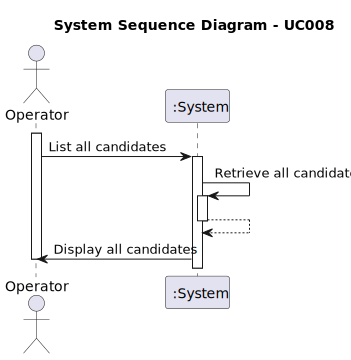

# UC 009 — As Operator, list all candidates.

## 1. Requirements Engineering

### 1.1. User Story Description

As an Operator, I want to list all candidates.

### 1.2. Customer Specifications and Clarifications

**From the specifications document:**

> None

**From the client clarifications:**

> **Question:** US 2000c, quando estiver a listar os candidatos basta listar os emails?

> **Answer:** Eu diria que faz sentido apresentar para cada candidato o seu email e o seu nome.

> **Question_** Na US 2000c, existem politicas de negócio em relação a listar os candidatos?

> **Answer:** Devem seguir eventuais condicionante relativas ao possível estado do candidato.

> **Question:** Ordem dos candidatos. Na US 2000c é pedido que implementemos a função de listar todos os candidatos. É
> necessário ordenar os candidatos (por exemplo por ordem alfabética do nome)? Se for, qual é o critério que devemos
> seguir?

> **Answer:** Sim, a listagem pode ser por ordem alfabética do nome.

> **Question:**
 
> **Answer:** 
### 1.3. Acceptance Criteria

* **AC1:** The list must be in alphabetical order by the candidate's name.

### 1.4. Found out Dependencies

* This Use Case is relative to US 2000a, which is related to the registration of candidates.

### 1.5 Input and Output Data

**Input Data:**

* Typed data:
    * None

* Selected data:
    * None

**Output Data:**

* Candidate list

### 1.6. System Sequence Diagram (SSD)

#

### 1.7 Other Relevant Remarks

* 
