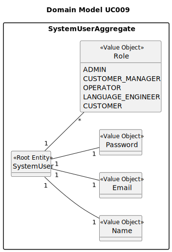

# UC 009 — As Operator, list all candidates.

## 2. Analysis

### 2.1. Relevant Domain Model Excerpt

)

### 2.2. Process Specification

#### 2.2.1. Normal Flow

1. **Authenticate Operator**: Verify that the user attempting to access the list is authenticated and authorized as an
   operator.
2. **Retrieve Candidates**: Fetch all candidate records from the data source, applying any necessary filters related to
   the candidate's status.
3. **Sort Candidates**: Sort the retrieved list of candidates alphabetically by name as per the acceptance criteria.
4. **Display Candidates**: Present the sorted list to the operator, showing each candidate's name and email.

#### 2.2.2. Exceptional Flows

- **EF002.1**: If there is an error during data retrieval, display an error message advising the operator to try again
  later.
- **EF002.2**: If no candidates are found, display a message indicating that there are no candidates available.

### 2.3. Functional Requirements Reevaluation

- **FR002.7**: The system must handle sorting of candidates by name in alphabetical order.
- **FR002.8**: The system should ensure that the candidate listing respects any business rules regarding the candidate's
  status.

### 2.4. Non-functional Requirements Specification

- **Security**: Ensure that only authenticated and authorized operators can access the candidate list.
- **Performance**: Queries should be optimized to handle potentially large volumes of candidate data efficiently.
- **Usability**: The candidate list interface should be easy to navigate and understand, even for operators with minimal
  technical skills.

### 2.5. Data Integrity and Security

- **Authorized Access**: Implement security checks to ensure that only operators have the ability to view the candidate
  list.
- **Data Validation**: No significant data modification is required in this use case, but validation may be necessary to
  ensure that the data meets the predefined format (e.g., valid emails).

### 2.6. Interface Design

- **Design Considerations**: The interface should align with the EAPLI framework’s existing design patterns, providing a
  consistent user experience.
- **User Interface**: Display candidate names and emails in a structured format, such as a table, which can also allow
  for future enhancements like searching and pagination.

### 2.7. Risk Analysis

- **Risk of Data Breach**: Unauthorized access to sensitive candidate information.
- **Mitigation Strategy**: Use robust authentication and authorization mechanisms to protect data access.

### 2.8. Decisions

- **Decision on Data Fetching Strategy**: Decide whether to implement real-time data fetching or use a cached approach
  based on expected system load and data volatility.
- **Decision on Technology Stack**: Select appropriate backend and frontend technologies that integrate smoothly with
  the existing EAPLI framework.

### 2.9. Documentation and Training

- **Documentation**: Update system documentation to include details on the candidate listing process.
- **Training**: Provide training for operators on how to use the new system functionality efficiently.
