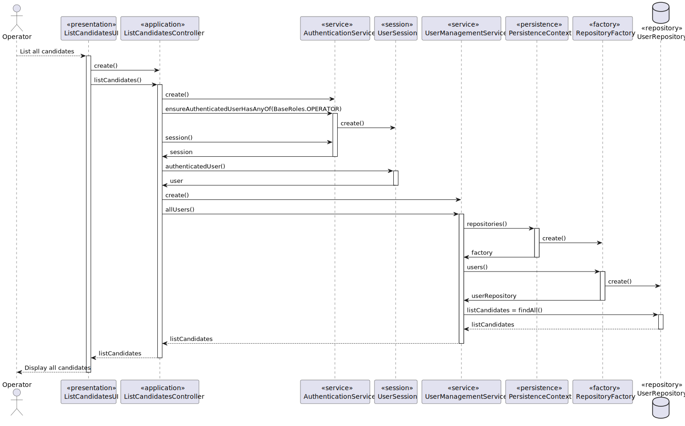
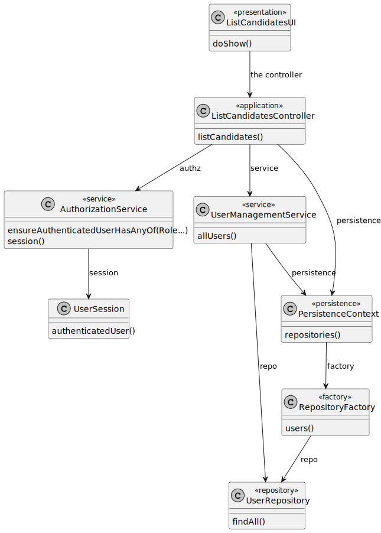

# UC 009 — As Operator, list all candidates.

## 3. Design - User Story Realization

### 3.1. Rationale

| Interaction ID                       | Question: Which class is responsible for... | Answer              | Justification (with patterns)                                                                                 |
|:-------------------------------------|:--------------------------------------------|:--------------------|:--------------------------------------------------------------------------------------------------------------|
| Step 1 : asks to list all candidates | interacting with the actor?                 | ListUsersUI         | Pure Fabrication: there is no reason to assign this responsibility to any existing class in the Domain Model. |
|                                      | coordinating the US?                        | ListUsersController | Controller                                                                                                    |
|                                      | knowing the user using the system?          | UserSession         | IE: cf. A&A component documentation.                                                                          |
|                                      | knowing the users to show                   | UserRepository      | IE: knows/has its own users                                                                                   |
| Step 2 : displays all candidates     | displaying the data?                        | ListUsersUI         | IE: is responsible for user interactions.                                                                     |

### Systematization ##

According to the taken rationale, the conceptual classes promoted to software classes are:

* ListUsersController, UserSession, UserRepository

Other software classes (i.e., Pure Fabrication) identified:

* ListUsersUI

## 3.2. Sequence Diagram (SD)

### Full Diagram

## 3.3. Class Diagram (CD)

