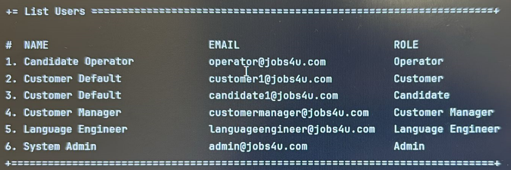

# UC 009 — As Operator, list all candidates.

# 4. Tests

* EAPLI framework was used, so all code is pre-tested and proven to work.

# 5. Construction (Implementation)

## Class ListUsersUI

```java
    @Override
    protected Iterable<SystemUser> elements() {
    return theController.activeUsers();
}
```

## Class ListUsersController

```java
    public Iterable<SystemUser> activeUsers() {
    authz.ensureAuthenticatedUserHasAnyOf(BaseRoles.ADMIN, BaseRoles.CUSTOMER_MANAGER, BaseRoles.OPERATOR);

    // Get active users as a List
    List<SystemUser> users = new ArrayList<>();
    userSvc.activeUsers().forEach(users::add);

    users.sort(Comparator.comparing(u -> u.name().toString()));

    // Return the sorted list as an Iterable
    return users;
}
```

# 6. Integration and Demo



# 7. Observations


