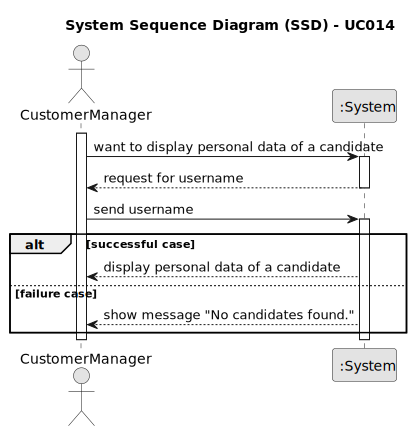

# UC 014

## 1. Requirements Engineering

### 1.1. User Story Description

> As Customer Manager, I want to display all the personal data of a candidate.

---

### 1.2. Customer Specifications and Clarifications

**From the specifications document:**

> 

**From the client clarifications:**

> **Question:** What candidate name information should appear (full name, first and last name, etc)?
>
> **Answer:** Initially, I would say it should be the name, as it was received in the application that was made (page 6, 'name of the candidate').

> **Question:** Regarding the listing of personal data for a specific candidate, will a customer manager have access to all candidates in the system or only to those candidates who submitted an application for a job opening of a client managed by that customer manager?
>
> **Answer:** In the current context, we will assume that the Customer Manager can access (consult) the personal data of any candidate.

> **Question:** Regarding the process of selecting a candidate and displaying their personal information, to facilitate the search for a specific candidate, would it make sense to ask the user if they want to list all existing candidates, or if they want to narrow down the list by selecting a job opening, thus showing all candidates for that job opening, and finally selecting a candidate from that smaller list?
> 
> **Answer:** The product owner expects the system to adhere to best practices in UI/UX, but as they are not an expert in this technical field, they refrain from suggesting specific solutions.

> **Question:** In US1006, it is necessary to display the personal data of the candidates. For this, what information do you think is pertinent to show?
> 
> **Answer:** It will be all the personal information of a candidate that the system has registered.

---

### 1.3. Acceptance Criteria

> AC014.1: There must be a page where the user can see all the personal data of a candidate.

---

### 1.4. Found out Dependencies

* This Use Case is relative to US 1000, which is related to the backoffice users management functionality.
* This Use Case is also related to US 2000a and 2000c, which are related to candidate management functionality.
* It relates to the following Use Cases as well:
  - [UC001](../../UC001/README.md) - As Admin, I want to register users of the backoffice.
  - [UC008](../../UC008/README.md) - As Operator, I want to register a candidate.
  - [UC009](../../UC009/README.md) - As Operator, I want to list all candidates.

---

### 1.5 Input and Output Data

**Input Data**

* Typed data:
  * Candidate's name
  * Candidate's email
  * Candidate's password
  * Candidate's phone number

* Selected data:
  * Username of the candidate

**Output Data:**

* Terminal:
  * Success of the operation
  * List of all personal data of a candidate (just the candidate details)

---

### 1.6. System Sequence Diagram (SSD)

### 1.7 Other Relevant Remarks