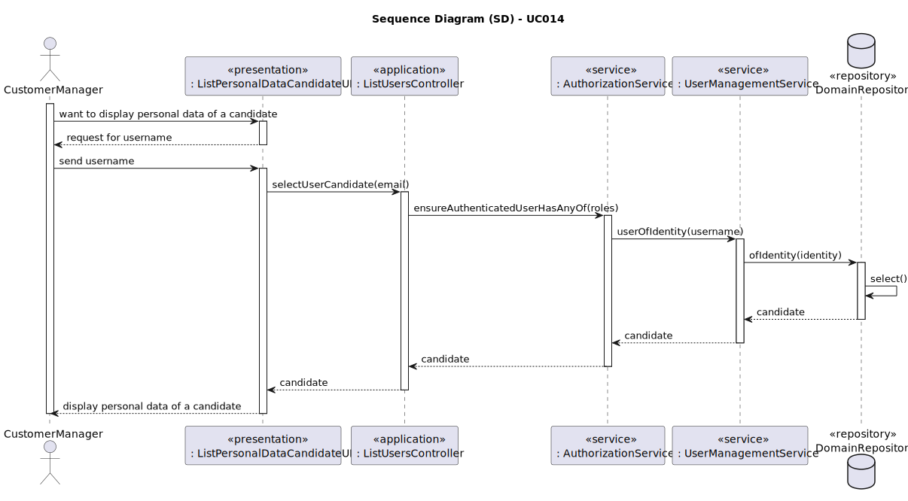
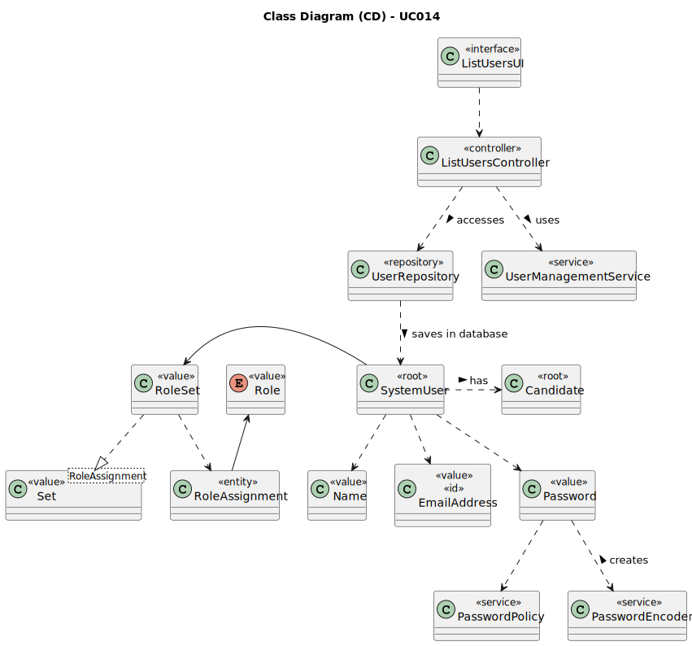

# UC014 - As Customer Manager, I want to display all the personal data of a candidate.

## 3. Design - User Story Realization 

### 3.1. Rationale

**SSD - Alternative 1 is adopted.**

| Interaction ID                                                                       | Question: Which class is responsible for...                               | Answer                      | Justification (with patterns)                                                                                                                                      |
|:-------------------------------------------------------------------------------------|:--------------------------------------------------------------------------|:----------------------------|:-------------------------------------------------------------------------------------------------------------------------------------------------------------------|
| Step 1: Login (as Customer Manager)                                                  | ... running the application's console?                                    | BaseApplication             | Pure Fabrication: BaseApplication is a class created with the purpose of running a console in our application.                                                     |
|                                                                                      | ... showing the backoffice console to do login?                           | BaseBackoffice              | Pure Fabrication: BaseBackoffice is a class created with the purpose of showing the backoffice console.                                                            |
|                                                                                      | ... showing the login menu?                                               | LoginUI                     | Pure Fabrication: LoginUI is a class created with the purpose of showing the login menu.                                                                           |
| Step 2: Allow access to the backoffice application with customer manager permissions | ... giving customer manager permissions to logged user?                   | CredentialHandler           | Service: CredentialHandler is a class that provides the service of validating login credentials.                                                                   |
| Step 3: Want to display personal data of a candidate                                 | ... interacting with the actor?                                           | ListPersonalDataCandidateUI | Pure Fabrication: ListPersonalDataCandidateUI is a class created with the purpose of displaying the console for the candidate list.                                |
|                                                                                      | ... controlling the flow of the use case?                                 | ListUsersController         | Controller: ListUsersController is a class created with the purpose of controlling the flow of the use case.                                                       |
|                                                                                      | ... retrieving the identity of a candidate?                               | UserManagementService       | Service: UserManagementService is a class that provides the typical application use cases for managing SystemUser (e.g. adding, deactivating, listing, searching). |
|                                                                                      | ... ensure customer manager has permissions to see candidate information? | AuthorizationService        | Service: AuthorizationService is a class that provides the service of validating login credentials.                                                                |
| Step 4: Search personal data                                                         | ... record the customer instance in the database?                         | DomainRepository            | Information Expert: DomainRepository is a class created with the purpose of recording user(candidates) instances in the database.                                  |
| Step 5: Display personal data of a candidate                                         | ... show list with candidates?                                            | ListPersonalDataCandidateUI | Pure Fabrication: ListPersonalDataCandidateUI is a class created with the purpose of displaying the list with candidate creation.                                  |

### Systematization ##

According to the taken rationale, the conceptual classes promoted to software classes are: 

* BaseApplication
* BaseBackoffice  
* CredentialHandler
* UserManagementService
* AuthorizationService
* Candidate

Other software classes (i.e. Pure Fabrication) identified: 

* LoginUI
* ListPersonalDataCandidateUI
* ListUsersController (Controller)
* DomainRepository (Repository)

## 3.2. Sequence Diagram (SD)

## 3.3. Class Diagram (CD)

