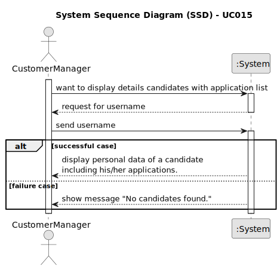

# UC 015

## 1. Requirements Engineering

### 1.1. User Story Description

> As Customer Manager, I want to display all the personal data of a candidate, including his/her applications.

---

### 1.2. Customer Specifications and Clarifications

**From the specifications document:**

>

**From the client clarifications:**

> **Question:** Regarding the information presented in 1006b, what type of information related to the candidate's "applications" do you expect to be presented to the customer manager?
>
> **Answer:** It is expected that the applications from this candidate will be listed, indicating to which job opening they pertain, the registration date of the application, its status, and its identifier.
>

---

### 1.3. Acceptance Criteria

> AC001.1: There must be a page where the user can see all the personal data of a candidate, including his/her applications.

---

### 1.4. Found out Dependencies

* This Use Case is relative to US 1000, which is related to the backoffice users management functionality.
* This Use Case is also related to US 2000a and 200c, which are related to candidate management functionality.
* It relates to the following Use Cases as well:
  - [UC001](../../UC001/README.md) - As Admin, I want to register users of the backoffice.
  - [UC008](../../UC008/README.md) - As Operator, I want to register a candidate.
  - [UC009](../../UC009/README.md) - As Operator, I want to list all candidates.
  - [UC014](../../UC014/README.md) - As Customer Manager, I want to display all the personal data of a candidate.

---

### 1.5 Input and Output Data

**Input Data**

* Typed data:
  * Candidate's name
  * Candidate's email
  * Candidate's password
  * Candidate's phone number
  * Candidate's job opening belongs to
  * The registration date of the application
  * The status of the application
  * The application identifier

* Selected data:
  * Username of the candidate

**Output Data:**

* Terminal:
  * Success of the operation
  * List of all personal data and applications of a candidate (just the candidate details)

---

### 1.6. System Sequence Diagram (SSD)

### 1.7 Other Relevant Remarks