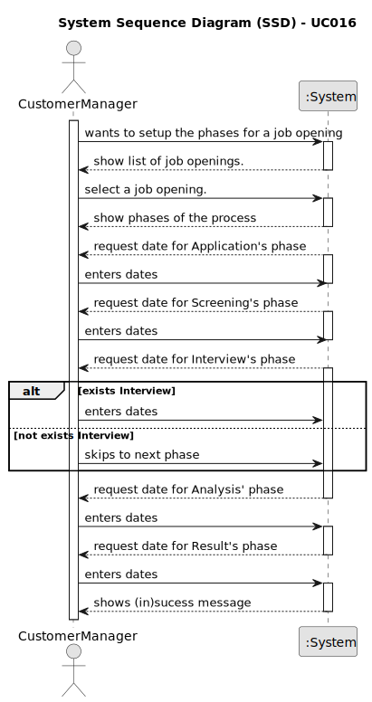

# UC 016

## 1. Requirements Engineering

### 1.1. User Story Description

> As Customer Manager, I want to setup the phases of the process for a job opening.

---

### 1.2. Customer Specifications and Clarifications

**From the specifications document:**

> The recruitment process for a job opening follows a sequence of phases: application; resume
screen; interviews; analysis; result.
> * Application This is the first phase of the process. During this phase candidates submit
    their applications.
> * Screening This phase follows the application phase. In this phase, applications are verified against a set of requirements. Applications that do not meet mandatory requirements are rejected.
> * Interviews This phase is not mandatory, but is common. During this phase, accepted
    candidates may be interviewed. Results for the interviews are registered for further
    analysis.
> * Analysis During this phase, the applications are analyzed (using all available information like interviews and curriculum) and candidates are ranked.
> * Result In this phase, candidates as well as customers are notified of the final result.
>
> The customer manager is responsible to setup the process, defining the dates for the phases
    and if the process includes interviews.

**From the client clarifications:**

> **Question:** US1007, o identificar do processo de recrutamento pode ser um numero automático ou seja mais especifico?
>
> **Answer:** O job opening tem um identificar. O processo de recrutamento de um job opening é um “tributo” desse job
> opening. À partida não vejo necessidade de ter um identificador “especial” para o processo de recrutamento (i.e.,
> fases do processo de recrutamento desse job opening).

> **Question:** Em termos de user interface, neste caso para o customer manager como é que deverá ser realizado o setup
> do recruitment process.
>
> **Answer:** Não tenho requisitos específicos para a user interface. Deve usar princípios de boas práticas de desenho
> de user interfaces tendo em conta “The customer manager is responsible to setup the process, defining the dates for
> the phases and if the process includes interviews” (secção 2.2.1)

> **Question:** Validez de uma Job Openings – A nossa questão principal seria: quando é que uma job opening é
> considerada
> válida? Tendo em conta as funcionalidades 1002, 1007, 1009, surgiu-nos uma duvida relativamente às job openings e à
> sua constituiçao. Na US1002, é suposto resgistar uma job opening e apenas depois, na US1009, devemos selecionar os
> requirements specifications para a dada job opening. Posto isto, aquando o registo da job opening, esta não iria
> possuir
> toda a informaçao obrigatória como requerido. Assim sendo, deveria haver uma ligação direta entre estas user stories
> de
> forma a que, aquando o registo, passamos automaticamente a selecionar os requirements obtendo assim uma job opening
> válida? Adicionalmente, queremos esclarecer se o recruitment process é algo obrigatório para a validez de um job
> opening.
>
> **Answer:** O product owner não é especialista do dominio da solução (apenas têm conhecimentos do problema) mas,
> quanto à primeira questão, sugere que talvez user stories não sejam (podem não ser) opções de menu “distintas”. Quanto
> à segunda questão (recruitment process) julgo que também está mais ligada à solução que ao problema, pelo que não vou
> sugerir nada que possa até complicar mais do que esclarecer.

> **Question:** Para um recruitment process vamos ter várias fases. O que é pretendido para o “Setup”?
>
> **Answer:** O processo de recrutamento, explicado na secção 2.2.1, define uma sequência de fases na qual apenas se
> indica como opcional a fase das entrevistas. O Setup consiste essencialmente em definir as datas para cada fase e se
> temos ou não a fase das entrevistas.

> **Question:** US1002, 1007, 1009 - Na US1002 ao registar um job opening é imperativo selecionar também o job
> requirement
> e/ou as fases de recrutamento?
>
> **Answer:** São US diferentes e, do meu ponto de vista, podem ser executadas em momentos diferentes. Apenas lembro
> que,
> como é evidente, desejo que o sistema esteja sempre num estado consistente.

> **Question:** Definir datas das fases- As fases do processo de recrutamento têm que ter datas atribuidas. É possivel
> terminar uma fase e começar outra no mesmo dia?
>
> **Answer:** Não deve haver sobreposição de datas, mas podemos permitir que terminem e iniciem no mesmo dia (ex: uma
> termina de manhã e a seguinte inicia-se de tarde).

> **Question:** Quando o customer manager quer dar setup das fases de uma job opening, como é que ele escolhe a mesma?
> Lista-se todas as job openings de todos os customers que ele é responsável? Ou lista-se todos os customers e ele
> seleciona o desejado e só depois seleciona a Job Opening?
>
> **Answer:** Eu queria evitar constrangir a forma como desenham a UI/UX (para esta ou outras US). Penso que devem usar
> as melhores práticas. Como product owner gostava que aplicassem as melhores praticas supondo que essas melhoram a
> interação dos utilizadores. Note ainda que existe a US1003.

> **Question:** - Um costumer manager deve conseguir fazer setup a todas os Job Openings disponíveis no sistema ou
> apenas as que ele registou(US1002) ?
>
> **Answer:** Deve fazer o Setup dos job openings do qual é responsável (que está a gerir).

---

### 1.3. Acceptance Criteria

> **AC016.1:** The Customer Manager can setup the phases of the process for a job opening.

> **AC016.2:** The Customer Manager can define the dates for each phase.

> **AC016.3:** The Customer Manager can define if the process includes interviews.

> **AC016.4:** The dates can't be overlapped, however, it is possible to end a phase and start another on the same day.

---

### 1.4. Found out Dependencies

* This Use Case is relative to US 1000, which is related to the backoffice users management functionality.
* This Use Case is relative to US 1002, which is related to the job openings management functionality.
* It relates to the following Use Cases as well:
    - [UC006](../../UC006/01.requirements-engineering/README.md) - As a Customer Manager, I want to register a job
      opening.
    - [UC007](../../UC007/01.requirements-engineering/README.md) - As a Customer Manager, I want to list job openings.

---

### 1.5 Input and Output Data

**Input Data:**

* Typed data:
    * JobOpening Reference
    * Date of the phases: 
      * Initial Date
      * Final Date

**Output Data:**

* Terminal:
    * (In)Success of the operation

---

### 1.6. System Sequence Diagram (SSD)

### 1.7 Other Relevant Remarks