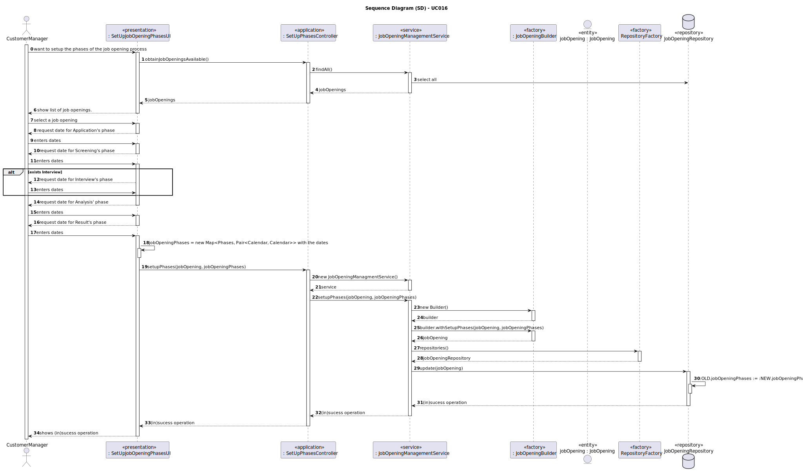
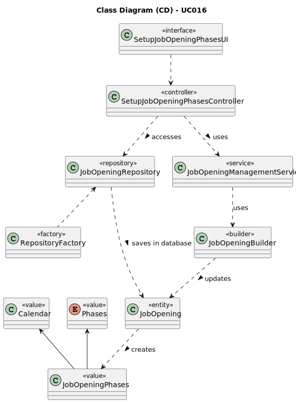

# UC016 - As Customer Manager, I want to setup the phases of the process for a job opening.

## 3. Design - User Story Realization

### 3.1. Rationale

**SSD - Alternative 1 is adopted.**

| Interaction ID                                                                       | Question: Which class is responsible for...                           | Answer                          | Justification (with patterns)                                                                                                   |
|:-------------------------------------------------------------------------------------|:----------------------------------------------------------------------|:--------------------------------|:--------------------------------------------------------------------------------------------------------------------------------|
| Step 1: Login (as Customer Manager)                                                  | ... running the application's console?                                | BaseApplication                 | Pure Fabrication: BaseApplication is a class created with the purpose of running a console in our application.                  |
|                                                                                      | ... showing the backoffice console to do login?                       | BaseBackoffice                  | Pure Fabrication: BaseBackoffice is a class created with the purpose of showing the backoffice console.                         |
|                                                                                      | ... showing the login menu?                                           | LoginUI                         | Pure Fabrication: LoginUI is a class created with the purpose of showing the login menu.                                        |
| Step 3: Allow access to the backoffice application with customer manager permissions | ... giving customer manager permissions to logged user?               | CredentialHandler               | Service: CredentialHandler is a class that provides the service of validating login credentials.                                |
| Step 4: Setup the phases of the process for a job opening                            | ... showing the job opening setup console?                            | SetupJobOpeningPhasesUI         | Pure Fabrication: SetupJobOpeningPhasesUI is a class created with the purpose of showing the job opening setup console.         |
|                                                                                      | ... controlling the flow of the use case?                             | SetupJobOpeningPhasesController | Controller: SetupJobOpeningPhasesController is a class created with the purpose of controlling the flow of the use case.        |
|                                                                                      | ... ensure customer manager has permissions to setup the job opening? | AuthorizationService            | Service: AuthorizationService is a class that provides the service of validating login credentials.                             |
| Step 5: Select a job opening available                                               | ... display all job openings available?                               | SetupJobOpeningPhasesUI         | Pure Fabrication: SetupJobOpeningPhasesUI is a class created with the purpose of showing the job opening setup console.         |
|                                                                                      | ... ensure the job opening is valid by checking its details?          | JobOpeningBuilder               | Factor: JobOpeningBuilder is a class that provides the service of validating job openings.                                      |
|                                                                                      | ... keep the job opening's details                                    | JobOpening                      | Information Expert: JobOpening has its own details.                                                                             |
| Step 6: Select a phase to setup                                                      | ... display all phases available?                                     | SetupJobOpeningPhasesUI         | Pure Fabrication: SetupJobOpeningPhasesUI is a class created with the purpose of showing the job opening setup console.         |
|                                                                                      | ... verifying if phases' dates don't overlap?                         | SetupJobOpeningPhasesUI         | Pure Fabrication: SetupJobOpeningPhasesUI is a class that will verify if data is correct before performing database operations. |
|                                                                                      | ... keep the phase's details                                          | Phases                          | Information Expert: Phases has its own details.                                                                                 |
| Step 7: Show (in)suces of the operation                                              | ... show the job opening phases's set up (in)success message?         | SetupJobOpeningPhasesUI         | Pure Fabrication: SetupJobOpeningPhasesUI is a class created with the purpose of showing the job opening setup success message. |

### Systematization ##

According to the taken rationale, the conceptual classes promoted to software classes are:

* BaseApplication
* BaseBackoffice
* CredentialHandler
* AuthorizationService
* JobOpeningBuilder
* JobOpening
* Phases

Other software classes (i.e. Pure Fabrication) identified:

* LoginUI
* SetupJobOpeningPhasesUI
* SetupJobOpeningPhasesController
* JobOpeningRepository

## 3.2. Sequence Diagram (SD)

## 3.3. Class Diagram (CD)

