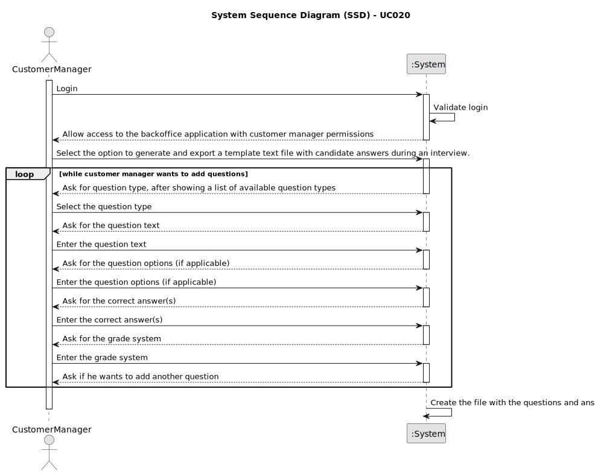

# UC020 - As Customer Manager, I want to generate and export a template text file with candidate answers during an interview.

## 1. Requirements Engineering

### 1.1. Use Case Description

> As Customer Manager, I want to generate and export a template text file with candidate answers during an interview.

---

### 1.2. Customer Specifications and Clarifications

**From the specifications document:**

- The system must allow the Customer Manager to generate and export a template text file with candidate answers during an interview.
- An interview model must be created by the Customer Manager (with the help of the Language Engineer to configure the plugin) with the desired questions.
- The interview is part of the process where a candidate is evaluated for a job opening.
- Interview questions will be provided by customers (by means that are out of scope of the system).

**From the client clarifications:**

> **Question:** Are the questions to be asked for the Interview Models and Requirement Specifications those in the documentation example, or is there a group of questions that you would like us to use?
>
> **Answer:** The specification document presents, as I said, examples. These are just indicative examples.
> You can use these examples as test cases and as a starting point for defining others. But the solution is supposed to support more than just the examples in the document.
> In any of the plugins, the type of questions that must be supported is what is presented on page 8 of the document.
> As a product owner, I would like a functional demonstration of the system to include at least two plugins of each type.
> This is to be able to demonstrate, at a minimum, support for more than one plugin used (of each type) simultaneously.
> You must also demonstrate the use of all question types presented on page 8.

> **Question:** Interview model and Requirements specification – Do the names to be used in these “concepts” have restrictions?
> 
> **Answer:** The name given to interview models or requirements specifications is a string that describes the “purpose” of this plugin.
> An example already given is “5 years java experience” for a requirements specification plugin that validates applications for a job opening for a job that requires 5 years of java experience.
---

### 1.3. Acceptance Criteria

> AC020.1: The Customer Manager must be able to generate a template text file with candidate answers during an interview.
>
> AC020.2: The Interview Model must be created according to the ANTLR grammar defined for the interview model (available in [UC019](../../UC019/README.md)).

---

### 1.4. Found out Dependencies

* This Use Case is relative to US 1012, which is related to the interview phase of the recruitment process.
* It relates to the following Use Case(s) as well:
  - [UC017](../../UC017/README.md) - As Customer Manager, I want to configure a plugin.
  - [UC019](../../UC019/README.md) - As Customer Manager, I want to select the interview model to be used in the interview.

### 1.5 Input and Output Data

**Input Data:**
- Typed Data:
  - Interview model name
  - Interview questions, options, answers and grade system

**Output Data:**
- (In)success of the operation

### 1.6. System Sequence Diagram (SSD)



### 1.7 Other Relevant Remarks

_Example .txt file to be created according to our ANTLR grammar:_

```text
INTERVIEW "Interview Model for Software Developer";

MCQUES "What is the best programing language for the system XPTO?";
OPT Java;
OPT C#;
OPT PHP;
OPT Javascript;
OPT Typescript;
SOL <Javascript|0.8>;
SOL <Typescript|0.4>;
SOL <Javascript, Typescript|1>;

INTQUES "What is the biggest integer that can be stored in a 16 bit signed integer?";
SOL <32767|1>;
```

- The template text file will be used to register candidate's answers during an interview.
- The template text file will be generated based on the interview model selected by the Customer Manager.
- The interview model will be created by the Customer Manager with the help of the Language Engineer to configure the plugin.
- The interview model will have the desired questions to be asked during the interview.