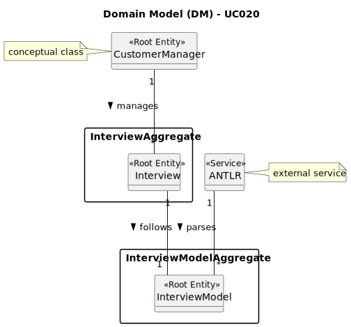

# UC020 - As Customer Manager, I want to generate and export a template text file with candidate answers during an interview.

## 2. Analysis

### 2.1. Relevant Domain Model Excerpt

### 2.2. Process Specification

#### 2.2.1. Normal Flow
1. **Authenticate Customer Manager**: Verify that the Customer Manager is logged in with appropriate permissions.
2. **Access Settings Interface**: Customer Manager navigates to the settings section of the backoffice.
3. **Select the Option to Export a Template Text File With Candidate Answers During an Interview**: Customer Manager selects the option to generate and export a template text file with candidate answers during an interview.
4. **Select the File Name for the Template Text File**: Customer Manager selects the file name for the template text file.
5. **Select the Questions to be Asked, the Options (if applicable), the Correct Answer(s) and the Grade System**: Customer Manager selects the questions to be asked, the options (if applicable), the correct answer(s), and the grade system.

#### 2.2.2. Exceptional Flows
- **EF020.1**: If there is no file with that name, the system shall create a new file.
- **EF020.2**: If there is an error generating the template text file, the system shall display an error message and prompt the Customer Manager to try again later.

### 2.3. Functional Requirements Reevaluation
- **FR020.1**: The system shall give the Customer Manager the option to generate and export a template text file with candidate answers during an interview.
- **FR020.2**: The system shall allow the Customer Manager to select the file name for the template text file.
- **FR020.3**: The system shall allow the Customer Manager to select the questions to be asked, the options (if applicable), the correct answer(s), and the grade system.
- **FR020.4**: The system shall create a new file if the file name does not exist.
- **FR020.5**: The system shall display an error message if there is an error generating the template text file.

### 2.4. Non-functional Requirements Specification
- **Security**: Assess encryption standards for transmitting user credentials.
- **Performance**: Ensure all processes complete within acceptable time limits, maintaining system responsiveness.
- **Usability**: Interface should be intuitive, guiding the Customer Manager smoothly throughout the whole process with clear instructions and error handling.

### 2.5. Data Integrity and Security
- **Authorized Access**: Ensure that user data is stored securely and that only authorized users (in this case, the customer manager) can access it.

### 2.6. Interface Design
- The interface will follow the EAPLI framework's design patterns, providing a user-friendly experience for the Customer Manager.

### 2.7. Risk Analysis
- **R020.1**: Unauthorized Access to User Data
    - **Mitigation**: Implement validation checks within the system to ensure that only customer managers can export the template text file.

### 2.8. Decisions
- **D020.1**: Give the customer manager an option to create a new .txt file if the file does not exist yet.