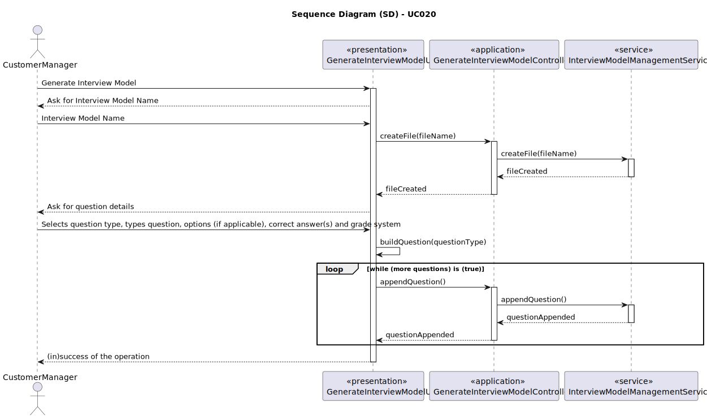
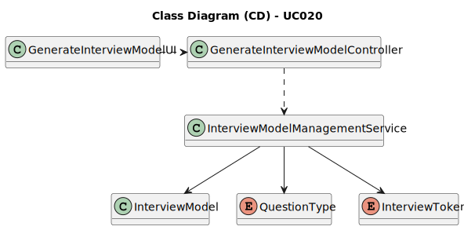

# UC020 - As Customer Manager, I want to generate and export a template text file with candidate answers during an interview.

## 3. Design - Use Case Realization

### 3.1. Rationale

| Interaction ID                                                                       | Question: Which class is responsible for...             | Answer                          | Justification (with patterns)                                                                                                |
|:-------------------------------------------------------------------------------------|:--------------------------------------------------------|:--------------------------------|:-----------------------------------------------------------------------------------------------------------------------------|
| Step 1: Login (as Customer Manager)                                                  | ... running the application's console?                  | BaseApplication                 | Pure Fabrication: BaseApplication is a class created with the purpose of running a console in our application.               |
|                                                                                      | ... showing the backoffice console to do login?         | BaseBackoffice                  | Pure Fabrication: BaseBackoffice is a class created with the purpose of showing the backoffice console.                      |
|                                                                                      | ... showing the login menu?                             | LoginUI                         | Pure Fabrication: LoginUI is a class created with the purpose of showing the login menu.                                     |
| Step 2: Validate login (as Customer Manager)                                         | ... validating the login credentials?                   | AuthenticationCredentialHandler | Service: AuthenticationCredentialHandler is a class that provides the service of validating login credentials.               |
|                                                                                      | ... showing the login (in)success message?              | LoginUI                         | Pure Fabrication: LoginUI is a class created with the purpose of showing the login success message.                          |
| Step 3: Allow access to the backoffice application with customer manager permissions | ... giving customer manager permissions to logged user? | AuthenticationCredentialHandler | Service: AuthenticationCredentialHandler is a class that provides the service of validating login credentials.               |
| Step 4: Select the option to export a template text file with candidate answers      | ... interacting with the customer manager?              | MainMenu                        | Pure Fabrication: MainMenu is a class created with the purpose of redirecting to the specific UI's.                          |
| Step 5: Ask for filename and fileformat                                              | ... interacting with the customer manager?              | ExportInterviewModelsUI         | Pure Fabrication: ExportInterviewModelsUI is a class created with the purpose of interacting with the user in this use case. |
|                                                                                      | ... controlling the flow of the use case?               | ExportInterviewModelsController | Controller: ExportInterviewModelsController is a class created with the purpose of controlling the flow of the use case.     |
|                                                                                      | ... know the file format?                               | FileFormat                      | Information Expert: FileFormat knows all its details                                                                         |
| Step 6: Export the interview model                                                   | ... retrieve all interview models from the database?    | ListInterviewModelService       | Service: InterviewModelRepository is a class that provides the service of retrieving interview models from the database      |
|                                                                                      | ... know all instances of interview models?             | InterviewModelRepository        | Information Expert: InterviewModelRepository knows all instances of interview models                                         |
|                                                                                      | ... know interview model's details?                     | InterviewModel                  | Information Expert: InterviewModel knows all its details                                                                     |
|                                                                                      | ... export the interview model?                         | InterviewModelExporter          | Service: InterviewModelExporter is a class that provides the service of exporting interview models                           |
|                                                                                      | ... creating the exporter?                              | InterviewModelExporterFactory   | Service: InterviewModelExporterFactory is a builder that creates InterviewModelExporter instances                            |
|                                                                                      | ... using the exporter?                                 | InterviewModelExporterService   | Service: InterviewModelExporterService is a class that provides the service of calling the exporter's methods                |
### Systematization ##

According to the taken rationale, the conceptual classes promoted to software classes are:

* InterviewModel
* FileFormat

Other software classes (i.e. Pure Fabrication) identified:

* LoginUI
* AuthenticationCredentialHandler
* MainMenu
* ExportInterviewModelsUI
* ExportInterviewModelsController
* InterviewModelRepository
* ListInterviewModelService
* InterviewModelExporterFactory
* InterviewModelExporterService
* InterviewModelExporter

## 3.2. Sequence Diagram (SD)

## 3.3. Class Diagram (CD)

