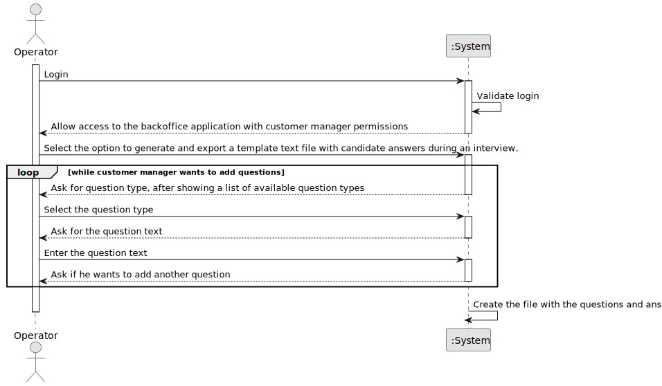

# UC021 - As Operator, I want to generate and export a template text file to help collect data fields for candidates of a job opening (so the data is used to verify the requirements of the job opening).

## 1. Requirements Engineering

### 1.1. Use Case Description

> As Operator, I want to generate and export a template text file to help collect data fields for candidates of a job opening (so the data is used to verify the requirements of the job opening).

---

### 1.2. Customer Specifications and Clarifications

**From the specifications document:**

- The system must allow the Customer Manager to generate and export a template text file job requirements specification.

**From the client clarifications:**

> **Question:** Are the questions to be asked for the Interview Models and Requirement Specifications those in the documentation example, or is there a group of questions that you would like us to use?
>
> **Answer:** The specification document presents, as I said, examples. These are just indicative examples.
> You can use these examples as test cases and as a starting point for defining others. But the solution is supposed to support more than just the examples in the document.
> In any of the plugins, the type of questions that must be supported is what is presented on page 8 of the document.
> As a product owner, I would like a functional demonstration of the system to include at least two plugins of each type.
> This is to be able to demonstrate, at a minimum, support for more than one plugin used (of each type) simultaneously.
> You must also demonstrate the use of all question types presented on page 8.

> **Question:** Interview model and Requirements specification – Do the names to be used in these “concepts” have restrictions?
> 
> **Answer:** The name given to interview models or requirements specifications is a string that describes the “purpose” of this plugin.
> An example already given is “5 years java experience” for a requirements specification plugin that validates applications for a job opening for a job that requires 5 years of java experience.
---

### 1.3. Acceptance Criteria

**AC01:** The system must allow the Customer Manager to generate a template text file with the job requirements specification.
---

### 1.4. Found out Dependencies

* This Use Case is relative to US 1012, which is related to the interview phase of the recruitment process.
* It relates to the following Use Case(s) as well:
  - [UC017](../../UC017/README.md) - As Customer Manager, I want to configure a plugin.
### 1.5 Input and Output Data

**Input Data:**
- Typed Data:
  - Job requirements name
  - Job requirements description

**Output Data:**
- (In)success of the operation

### 1.6. System Sequence Diagram (SSD)



### 1.7 Other Relevant Remarks

_Example .txt file to be created according to our ANTLR grammar:_

```text
JOB REQUIREMENTS "Example 1"

# Enter the number of years of experience (integer)
Experience-years: 2
# Select one degree (None; Bachelor; Master; PhD)
Academic-degree: None
# Select one or more programming languages you're proficient in (java; javascript; python)
Programming-languages: java, javascript
```
