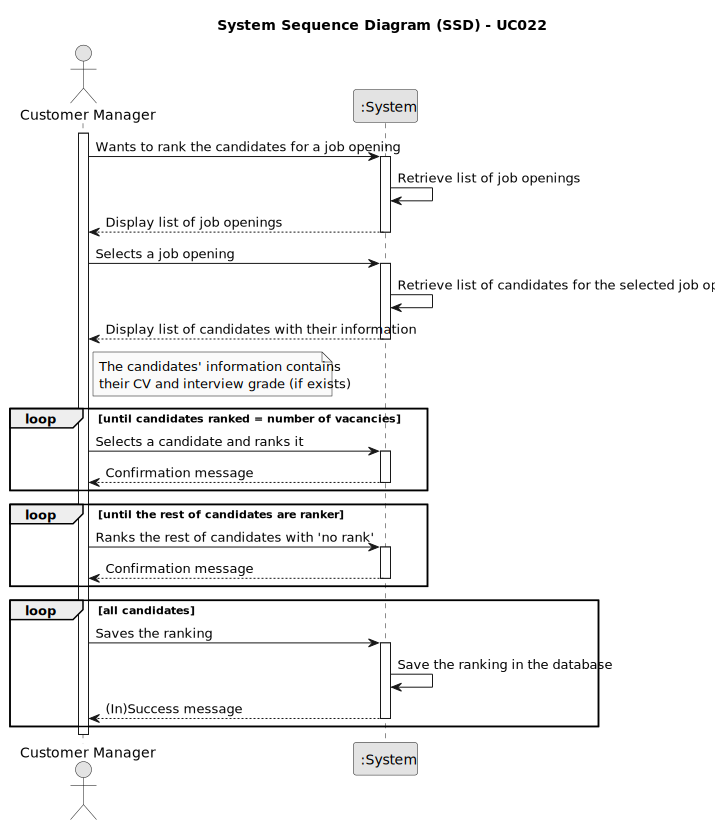

# UC022 - As Customer Manager, I want to rank the candidates for a job opening

## 1. Requirements Engineering

### 1.1. Use Case Description

> As Customer Manager, I want to rank the candidates for a job opening

---

### 1.2. Customer Specifications and Clarifications

**From the specifications document:**

- Applications are analyzed during the 'Analysis' phase, using their curriculum and interview grade, if exists.
- Candidates are ranked as the customer manager wishes.
- No candidates that will be ranked in the same position.
- Some candidates will be ranked as 'not ranked' in case there are no more ranking spaces left.

**From the client clarifications:**

> **Question:** Relativamente à secção 2.2.1, é na fase de Analysis que as entrevistas são avaliadas e é esse resultado 
> que define o ranking dos candidatos? Além disso, para que serve o CV nesta fase? Visto que as entrevistas não são 
> obrigatórias, o que acontece quando estas não se realizam?
>
> **Answer:** A pontuação das entrevistas é efetuada/calculada na fase das entrevistas. O CV e outros dados (como o 
> resultado das entrevistas) é usado pelo Customer manager na fase de analise para ordenar os candidatos. Mas a ordenação 
> é da responsabilidade do Customer Manager (por exemplo, não tem de seguir a ordem da pontuação nas entrevistas). A US
> 1013 corresponde à ordenação manual dos candidatos feita pelo Customer Manager. O facto de não haver entrevistas não 
> tem implicações na ordenação dos candidatos pois esta não depende explicitamente das entrevistas.

> **Question:** Candidate Ranking – Mr Client mention a manual ranking [*previous question*]. If the pontuation of an 
> interview is not essential for the candidate's rank, what criteria is to be used when ranking?
>
> **Answer:** Please view again [*previous question*]. The ranking is a decision of the Customer Manager based on all the 
> data that he/she may have during the process (including CV and other attached documents and the interviews as well as 
> other data/information that may not be part of the system).
 
> **Question:** A minha questão é relativa a como o ranking é feito. O customer manager dá uma nota a cada candidatura e
> o sistema ordena por ordem crescente sendo assim atribuído o ranking de cada candidatura? Se for assim, a nota terá que
> escala? Caso ainda seja assim ele só pode atribuir uma nota quando tiver conhecimento de todas? Ou pode ir colocando e
> o ranking só é atribuído quando todas as candidaturas já estiverem avaliadas?
> 
> **Answer:** A ordenação dos candidatos (ranking) é da responsabilidade do customer manager. Ele pode basear-se no 
> resultado das entrevistas e de outra informação, mas o ranking não é automático. Não há nota nem escala a usar. As 
> candidaturas são ordenadas.  

> **Question:** Stop the ranking process - When a customer manager starts the ranking process, he can stop and continue 
> later? Or the ranking process must be done in one go?
>
> **Answer:** I guess it may depend on how you implement the solution. But, in the case it may work as a “long 
> operation” be aware of when and how to conclude the “operation”.

> **Question:** Edit ranking - The customer manager can change the rank of a candidate after assigning it?
> 
> **Answer:** That should be possible if none of the interested parties were yet notified of the results.
 
> **Question:** Rank Entries - Is there a limit on rank entries? Let's say that 100 candidates apply for a job opening. 
> Does the Customer Manager have to sort all 100 candidates?
> 
> **Answer:** The order of candidates should include at least all the first candidates within the vacancy number and 
> some following candidates. At the moment, I do not know exactly the number of the following candidates to be ordered.
> Therefore, I would like for it to be a global configuration property in the system. It could be a number representing 
> a magnitude from the vacancy number. For instance, 1 could mean exactly the same number of vacancies, 2 the double, 
> 0,5 half the number of vacancies. The remainder of the candidates could be just tagged as not ranked.

> **Question:** Rank the candidates for a job Opening is the same as rank the job Applications for a Job Opening, 
> knowing that I can only know the candidates throw the job application?
>
> **Answer:** In the context of a job opening, a candidate is someone that made an application to that job opening. But 
> the same person can be a candidate to other job openings.

 
---

### 1.3. Acceptance Criteria

> AC001.1: If the user is successfully registered, he/she must be able to log in the backoffice application.
>
> AC001.2: The admin must be able to register a user with the following information: name, email, password, and role (in the backoffice: customer manager, language engineer or operator).

---

### 1.4. Found out Dependencies

* This Use Case is relative to US 1000, which is related to the backoffice users management functionality.
* It relates to the following Use Cases as well:
  - [UC002](../../UC002/README.md) - As Admin, I want to be able to enable users of the backoffice.
  - [UC003](../../UC003/README.md) - As Admin, I want to be able to disable users of the backoffice.
  - [UC004](../../UC004/README.md) - As Admin, I want to be able to list users of the backoffice.

### 1.5 Input and Output Data

**Input Data:**
- Typed data:
	- Job Opening
- Selected data:
	- Candidates

**Output Data:**
- Success or failure of the operation

### 1.6. System Sequence Diagram (SSD)

### 1.7 Other Relevant Remarks
- n/a