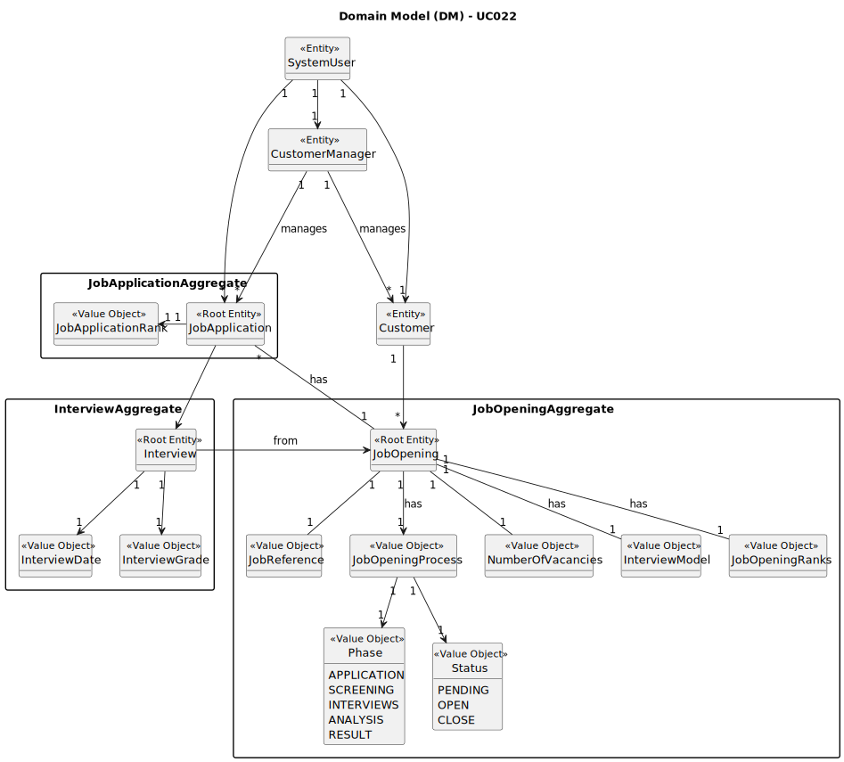

# UC022 - As Customer Manager, I want to rank the candidates for a job opening

## 2. Analysis

### 2.1. Relevant Domain Model Excerpt

### 2.2. Process Specification

#### 2.2.1. Normal Flow
1. **Authenticate Admin**: Verify that the Customer Manager is logged in with appropriate permissions.
2. **Access User Management Interface**: Customer Manager navigates to the job opening management section of the backoffice.
3. **Enter needed Details**:
   * 3.1 Customer Manager inputs the job opening's reference and gets the candidates to rank.
   * 3.2 Customer Manager selects the candidate to be ranked and inputs a valid rank.
   * 3.3 The candidates that weren't selected are ranked automatically with "no rank".
4. **Validate Inputs**:
   * 4.1 The system validates the job opening reference informs the Customer Manager.
   * 4.2 The system validates the candidate's rank and the system doesn't permit the Customer Manager to rank the same candidate more than once or rank different candidates with the same rank.
   * 4.3 The system ranks the remaining candidates with "no rank", only if there are remaining candidates.
   * 4.4 If the number of candidates is below the number of vacancies, all candidates need to be ranked.
5. **Save Ranks**: On successful validation, the system saves the candidates ranks in database, for further use.
6. **Confirmation to Customer Manager**: Display a success message to the Customer Manager upon successful ranking.

#### 2.2.2. Exceptional Flows
- **EF022.1**: If the rank is already in use, the system shall display a message to the Customer Manager.
- **EF022.2**: If the Customer Manager tries to rank the same candidate more than once, the system shall display a message to the Customer Manager.

### 2.3. Functional Requirements Reevaluation
- **FR022.1**: The system shall allow the Customer Manager to rank the candidates for a job opening.
- **FR022.2**: The system shall validate the rank input by the Customer Manager.
- **FR022.3**: The system shall automatically rank the remaining candidates with "no rank".

### 2.4. Non-functional Requirements Specification
- **Security**: Assess encryption standards for storing and transmitting user credentials.
- **Performance**: Ensure user registration processes complete within acceptable time limits, maintaining system responsiveness.
- **Usability**: Interface should be intuitive, guiding the Customer Manager smoothly through the ranking process with clear instructions and error handling.

### 2.5. Data Integrity and Security
- Outline the security measures for data handling, particularly how personal data is protected in line with compliance requirements (e.g., GDPR).
- Detail encryption methods for password storage and secure transmission mechanisms for sensitive data.

### 2.6. Interface Design
- The interface will follow the EAPLI framework's design patterns, providing a user-friendly experience for the Admin.

### 2.7. Risk Analysis
- **R022.1**: Duplicate Candidate Ranks
    - **Mitigation**: Implement validation checks to prevent the Customer Manager from ranking the same candidate more than once.
- **R022.2**: System Failure during Ranking Process
  - **Mitigation**: Implement error handling mechanisms to notify the Customer Manager of any system failures and provide guidance on how to proceed.

### 2.8. Decisions
- **D022.1**: Create classes for ranking the candidates ("JobApplicationRank", "JobApplicationRankService").
- **D022.2**: Create classes for evaluating the candidates' interview ("InterviewGrade").
- **D022.3**: Implement validation checks for the rank input to prevent duplicate ranks.
- **D022.4**: Implement automatic ranking for remaining candidates with "no rank".
  - **D022.5**: Implement a success message upon successful ranking.