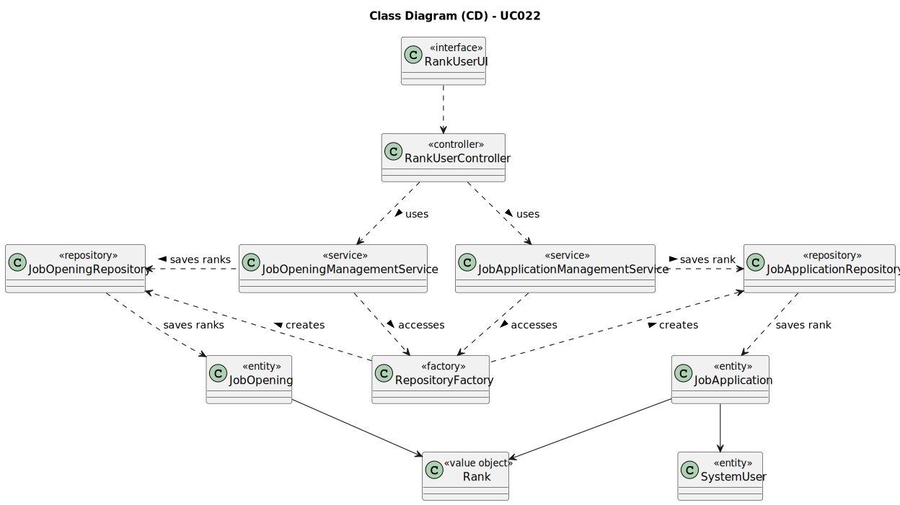

# UC022 - As Customer Manager, I want to rank the candidates for a job opening

## 3. Design - Use Case Realization

### 3.1. Rationale

| Interaction ID                                                                       | Question: Which class is responsible for...                           | Answer                          | Justification (with patterns)                                                                                                 |
|:-------------------------------------------------------------------------------------|:----------------------------------------------------------------------|:--------------------------------|:------------------------------------------------------------------------------------------------------------------------------|
| Step 1: Login (as Customer Manager)                                                  | ... running the application's console?                                | BaseApplication                 | Pure Fabrication: BaseApplication is a class created with the purpose of running a console in our application.                |
|                                                                                      | ... showing the backoffice console to do login?                       | BaseBackoffice                  | Pure Fabrication: BaseBackoffice is a class created with the purpose of showing the backoffice console.                       |
|                                                                                      | ... showing the login menu?                                           | LoginUI                         | Pure Fabrication: LoginUI is a class created with the purpose of showing the login menu.                                      |
| Step 2: Validate login (as Customer Manager)                                         | ... validating the login credentials?                                 | CredentialHandler               | Service: CredentialHandler is a class that provides the service of validating login credentials.                              |
|                                                                                      | ... showing the login (in)success message?                            | LoginUI                         | Pure Fabrication: LoginUI is a class created with the purpose of showing the login success message.                           |
| Step 3: Allow access to the backoffice application with customer manager permissions | ... giving admin permissions to logged user?                          | CredentialHandler               | Service: CredentialHandler is a class that provides the service of validating login credentials.                              |
| Step 4: Rank applications                                                            | ... showing the user creation console?                                | RankJobApplicationsUI           | Pure Fabrication: RankJobApplicationsUI is a class created with the purpose of showing the user creation console.             |
|                                                                                      | ... controlling the flow of the use case?                             | RankJobApplicationsController   | Controller: RankJobApplicationsController is a class created with the purpose of controlling the flow of the use case.        |
|                                                                                      | ... ensure customer manager has permissions to rank job applications? | AuthorizationService            | Service: AuthorizationService is a class that provides the service of validating login credentials.                           |
| Step 5: Enter applications' rank                                                     | ... communicating with user?                                          | RankJobApplicationsUI           | Pure Fabrication: RankJobApplicationsUI is a class created with the purpose of showing the user creation console.             |
|                                                                                      | ... ensure the jobApplication rank is valid by checking its details?  | JobApplicationManagementService | Service: JobApplicationManagementService is a class that provides the service of validating job application's rank.           |
|                                                                                      | ... ensure the jobOpening rank is valid by checking its details?      | JobOpeningManagementService     | Service: JobOpeningManagementService is a class that provides the service of validating job application's rank.               |
|                                                                                      | ... keep the job application rank's details                           | JobApplication                  | Information Expert: JobApplication has its own details.                                                                       |
|                                                                                      | ... keep the job opening ranks' details                               | JobOpening                      | Information Expert: JobOpening has its own details.                                                                           |
| Step 6: Saves applications' rank                                                     | ... record the job applications' rank instance is the database?       | JobApplicationRepository        | Information Expert: JobApplicationRepository is a class created with the purpose of recording user instances in the database. |
|                                                                                      | ... record the job opening ranks instance in the database?            | JobOpeningRepository            | Information Expert: JobOpeningRepository is a class created with the purpose of recording user instances in the database.     |
| Step 7: Show (in)success of the operation's message                                  | ... show the (in)success message?                                     | RankJobApplicationsUI           | Pure Fabrication: RankJobApplicationsUI is a class created with the purpose of showing the user creation success message.     |

### Systematization ##

According to the taken rationale, the conceptual classes promoted to software classes are:

* SystemUser
* Rank
* JobApplication
* JobOpening

Other software classes (i.e. Pure Fabrication) identified:

* BaseApplication
* BaseBackoffice
* LoginUI
* RankJobApplicationUI
* RankJobApplicationController
* JobApplicationRepository
* CredentialHandler
* AuthorizationService
* JobApplicationManagementService
* JobOpeningManagementService

## 3.2. Sequence Diagram (SD)

## 3.3. Class Diagram (CD)

