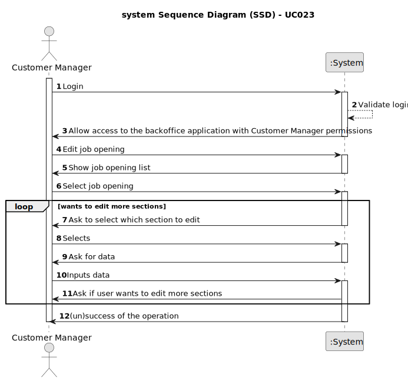

# UC023 — As Costumer Manager, I want to edit a job opening.

## 1. Requirements Engineering

### 1.1. Use Case Description

> As Costumer Manager, I want to edit a job opening.

---

### 1.2. Customer Specifications and Clarifications

**From the specifications document:**

> A job opening includes:
  • Job Reference A unique identifier of the job opening (generated by the system, for instance based on the
> customer code followed by a sequential number)
  • Title or function - Such as "front end programmer"
  • Contract Type - Such as full-time or part-time
  • Mode - Such as remote, hybrid, onsite
  • Address - Address for job
  • Company - Customer name
  • Number of vacancies
  • Description
  • Requirements

**From the client clarifications:**

> **Question:** Quando o Costumer Manager quer editar uma Job Opening, é suposto ele escolher qual Job Opening quer
> editar a partir de uma pesquisa pela referência?

> **Answer:** A questão refere-se um pouco a boas práticas de UI/UX. O contexto indicado na pergunta refere-se a uma
> situação em que o utilizador tem de identificar a entidade/objeto que deseja editar. Pode-se assumir que o utilizador
> sabe esse identificador. Mas, em termos de UX/UI deve ser possível obter esse identificar por outras vias (até porque
> é
> um identificar gerado pelo sistema). Penso que, para este caso particular, existe já uma US que permite fazer isso.

> **Question:** No seguimento da US 1004 para permitir editar um job opening, estamos a assumir que é permitido alterar:
> Nº de vagas; Morada; Contract Type('FULL_TIME', 'PART_TIME'); Mode ('ON_SITE','REMOTE'); Description; Funcao. Estamos
> na
> linha de raciocício correta, ou é necessário alterar a lista para incluir outra informação adicional ou suprimir
> alguma
> desta lista?

> **Answer:** Do meu ponto de vista deve ser possível alterar “tudo” exceto o próprio job reference. Deve-se ter em
> conta a manutenção do estado de consistência do sistema.

> **Question:**

> **Answer:**

---

### 1.3. Acceptance Criteria

>
 
---

### 1.4. Found out Dependencies

* This Use Case is relative to "US1003 — As Customer Manager, I want to list job openings.", since the user needs to
  choose the job opening to edit from a list.

### 1.5 Input and Output Data

**Input Data:**

- Typed data:
    - Changes in section of job opening

- Automatic data:
    - None

- Selected data:
    - Job opening

**Output Data:**

- Success or failure of the operation

### 1.6. System Sequence Diagram (SSD)

### 1.7 Other Relevant Remarks

- The system must request if the user wants to keep editing the job opening.