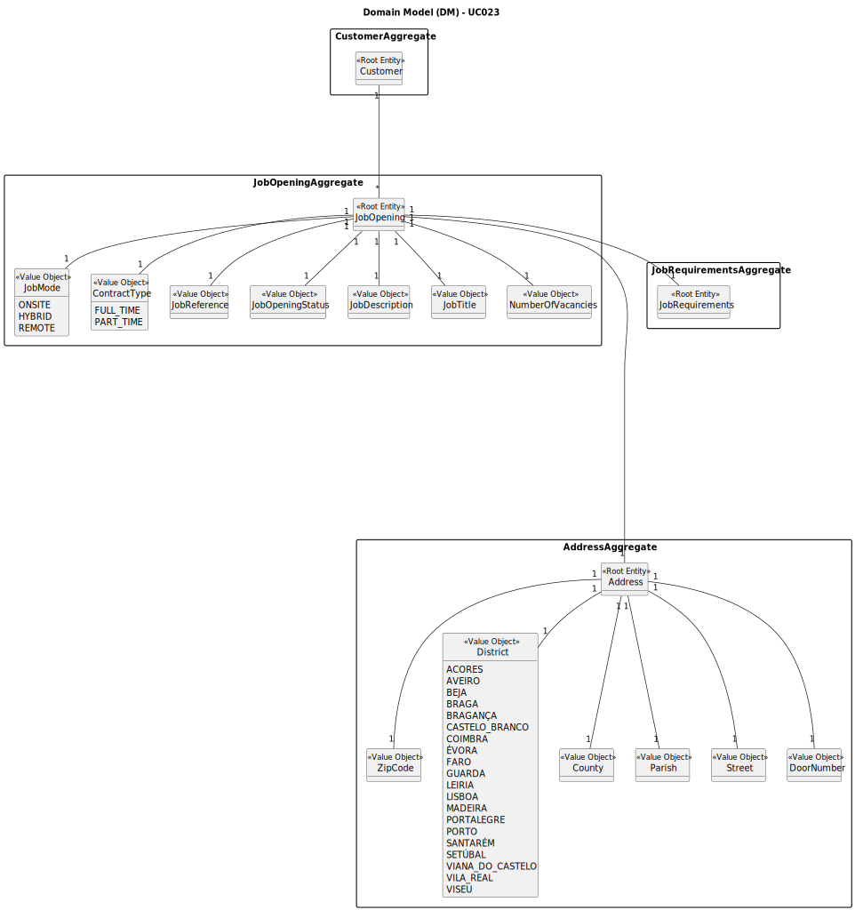

# UC023 — As Costumer Manager, I want to edit a job opening.

## 2. Analysis

### 2.1. Relevant Domain Model Excerpt

The following diagram was extracted from the EAPLI framework (provided by the course's teachers).

### 2.2. Process Specification

#### 2.2.1. Normal Flow

1. **Customer Manager Login:** The Customer Manager logs into the system using their credentials.

2. **Access Backoffice:** Upon successful login, the system validates the credentials and grants access to the
   backoffice application with Customer Manager permissions.

3. **Edit Job Opening:** The Customer Manager selects the option to edit a job opening.

4. **Select Job Opening:** The system presents a list of available job openings, and the Customer Manager selects the
   one they want to edit.

5. **Edit Job Details:** The system prompts the Customer Manager to select which sections of the job opening they want
   to edit. The Customer Manager selects the sections and provides the updated information.

6. **Confirmation:** After editing the desired sections, the system confirms the success of the operation to the
   Customer Manager.

#### 2.2.2. Exceptional Flows

- **EF002.1**: If there is a system error during the job opening edition, the system notifies the Customer Manager of
  the failure and suggests retrying.

### 2.3. Functional Requirements Reevaluation

No changes identified from the initial requirements.

### 2.4. Non-functional Requirements Specification

No changes identified from the initial requirements.

### 2.5. Data Integrity and Security

No changes identified from the initial requirements.

### 2.6. Interface Design

- The interface will adhere to the EAPLI framework's design patterns to ensure consistency and usability.
- It will provide clear options for the Customer Manager to select and edit different sections of the job opening.
- Error messages will be displayed in a user-friendly manner, guiding the Customer Manager on how to proceed in case of
  system errors.

### 2.7. Risk Analysis

No additional risks identified from the initial analysis.

### 2.8. Decisions

No new decisions made since the initial analysis.
