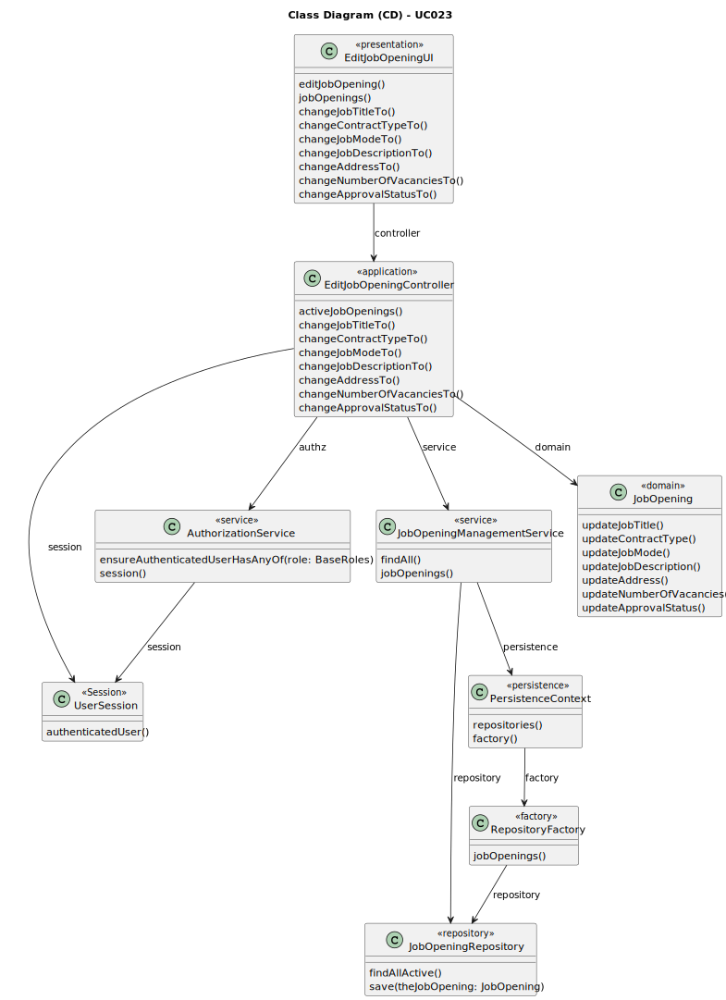

# UC023 — As Costumer Manager, I want to edit a job opening.

## 3. Design - Use Case Realization

### 3.1. Rationale

| Interaction ID                                                              | Question: Which class is responsible for...                   | Answer                   | Justification (with patterns)                                                                                           |
|:----------------------------------------------------------------------------|:--------------------------------------------------------------|:-------------------------|:------------------------------------------------------------------------------------------------------------------------|
| Step 1: Login (as Customer Manager)                                         | ... running the application's console?                        | BaseApplication          | Pure Fabrication: BaseApplication is a class created with the purpose of running a console in our application.          |
|                                                                             | ... showing the backoffice console to do login?               | BaseBackoffice           | Pure Fabrication: BaseBackoffice is a class created with the purpose of showing the backoffice console.                 |
|                                                                             | ... showing the login menu?                                   | LoginUI                  | Pure Fabrication: LoginUI is a class created with the purpose of showing the login menu.                                |
| Step 2: Validate login (as Customer Manager)                                | ... validating the login credentials?                         | CredentialHandler        | Service: CredentialHandler is a class that provides the service of validating login credentials.                        |
|                                                                             | ... showing the login (in)success message?                    | LoginUI                  | Pure Fabrication: LoginUI is a class created with the purpose of showing the login success message.                     |
| Step 3: Allow access to the backoffice application with manager permissions | ... giving manager permissions to logged user?                | CredentialHandler        | Service: CredentialHandler is a class that provides the service of validating login credentials.                        |
| Step 4: Edit job opening                                                    | ... showing the job opening edit console?                     | EditJobOpeningUI         | Pure Fabrication: EditJobOpeningUI is a class created with the purpose of showing the job opening edit console.         |
|                                                                             | ... controlling the flow of the use case?                     | EditJobOpeningController | Controller: EditJobOpeningController is a class created with the purpose of controlling the flow of the use case.       |
|                                                                             | ... ensure the manager has permissions to edit a job opening? | AuthorizationService     | Service: AuthorizationService is a class that provides the service of validating manager permissions.                   |
| Step 5: Modify job details                                                  | ... communicating with manager?                               | EditJobOpeningUI         | Pure Fabrication: EditJobOpeningUI is a class created with the purpose of communicating with the manager.               |
|                                                                             | ... ensure the modified job details are valid?                | JobDetailsValidator      | Service: JobDetailsValidator is a class that provides the service of validating modified job details.                   |
|                                                                             | ... keep the modified job details?                            | JobOpening               | Information Expert: JobOpening has its own details.                                                                     |
| Step 6: Update job opening                                                  | ... ensure the job opening exists and is modifiable?          | JobOpeningService        | Service: JobOpeningService is a class that provides the service of updating job openings.                               |
|                                                                             | ... record the updated job opening in the database?           | JobOpeningRepository     | Information Expert: JobOpeningRepository is a class created with the purpose of recording job openings in the database. |
| Step 7: Show (in)success of the operation's message                         | ... show the job opening edit (in)success message?            | EditJobOpeningUI         | Pure Fabrication: EditJobOpeningUI is a class created with the purpose of showing the job opening edit success message. |

### Systematization ##

According to the taken rationale, the conceptual classes promoted to software classes are:

* BaseApplication
* BaseBackoffice
* LoginUI
* CredentialHandler
* EditJobOpeningUI
* EditJobOpeningController
* AuthorizationService
* JobOpening
* JobOpeningManagementService
* JobOpeningRepository

Other software classes (i.e. Pure Fabrication) identified:

* EditJobOpeningUI

## 3.2. Sequence Diagram (SD)

## 3.3. Class Diagram (CD)

