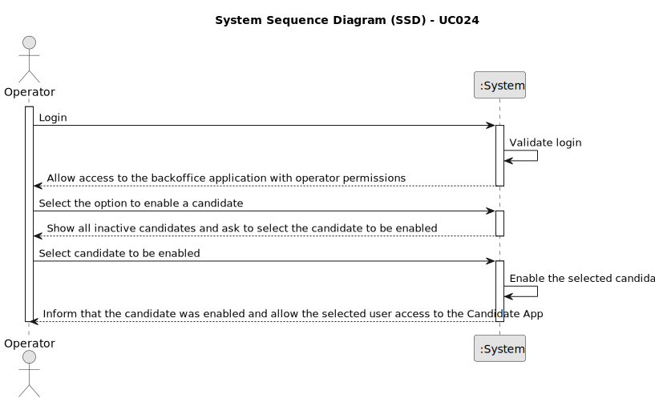

# UC024 - As Operator, I want to enable a candidate

## 1. Requirements Engineering

### 1.1. Use Case Description

> As Operator, I want to enable a candidate so that he/she can access the Candidate App.

---

### 1.2. Customer Specifications and Clarifications

**From the specifications document:**

- The operator must be able to register, enable and disable candidates.
- The operator must be able to select the candidate to enable from a list of inactive candidates.
- After being enabled, the candidate must be able to access the Candidate App.
- The operator must be informed if the candidate was successfully enabled or not.

**From the client clarifications:**

> **Question:** What is the candidate enable/disable?
> 
> **Answer:** Refers to disabling the candidate's access to the system (i.e., Candidate App)

> **Question:** Would the client like two different menus to be created, with each menu responsible for either activating or deactivating candidates?
> 
> **Answer:** I have no specific requirements for the UX/UI, but I want it to follow best practices.

---

### 1.3. Acceptance Criteria

> AC024.1: The operator must be able to enable a candidate by selecting which candidate to enable.
>
> AC024.2: Only inactive candidates can be enabled.
> 
> AC024.3: The operator must be informed if the candidate was successfully enabled or not.
> 
> AC024.4: Access must only be granted to the Candidate App.
> 
> AC024.5: There must exist a Candidate entity related to the user.

---

### 1.4. Found out Dependencies

* This Use Case is relative to US 2000b, which is related to the backoffice users management functionality.
* It relates to the following Use Cases as well:
  - [UC001](../../../SPRINT_B/UC001/README.md) - As Admin, I want to be able to register users of the backoffice.
  - [UC025](../../UC025/README.md) - As Operator, I want to be able to disable candidates.

### 1.5 Input and Output Data

**Input Data:**
- Selected data:
	- Candidate to be enabled

**Output Data:**
- List of candidates liable to be enabled (inactive candidates)
- Success or failure of the operation

### 1.6. System Sequence Diagram (SSD)

### 1.7 Other Relevant Remarks

- As said earlier, the user management functionality depends on the system's ability to authenticate users and manage roles appropriately.