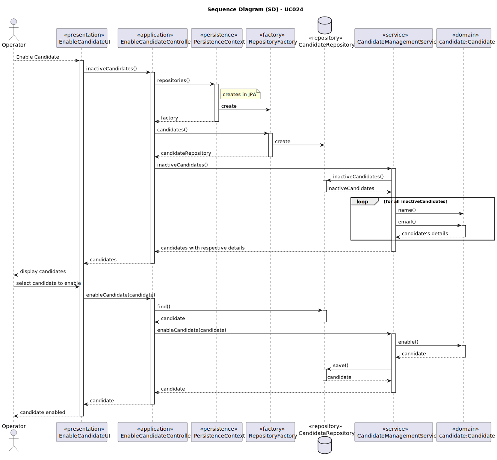
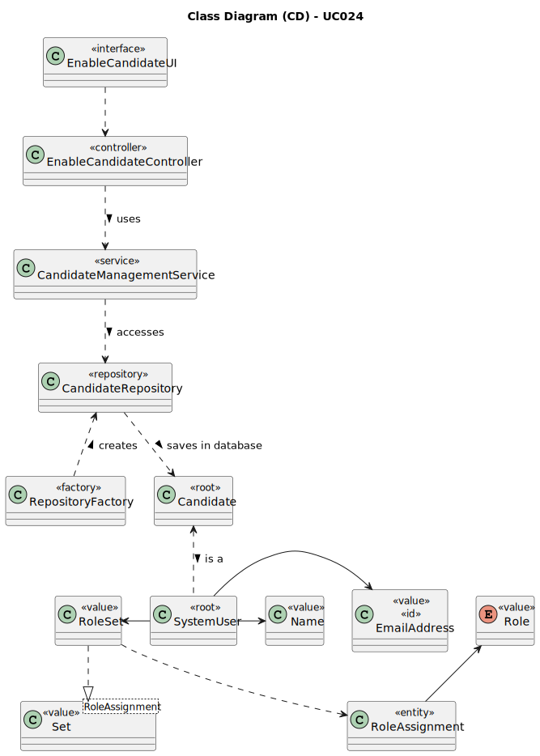

# UC024 - As Operator, I want to enable candidates

## 3. Design - Use Case Realization

### 3.1. Rationale

| Interaction ID                                                               | Question: Which class is responsible for...                  | Answer                          | Justification (with patterns)                                                                                                                                        |
|:-----------------------------------------------------------------------------|:-------------------------------------------------------------|:--------------------------------|:---------------------------------------------------------------------------------------------------------------------------------------------------------------------|
| Step 1: Login (as Operator)                                                  | ... running the application's console?                       | BaseApplication                 | Pure Fabrication: BaseApplication is a class created with the purpose of running a console in our application.                                                       |
|                                                                              | ... showing the backoffice console to do login?              | BaseBackoffice                  | Pure Fabrication: BaseBackoffice is a class created with the purpose of showing the backoffice console.                                                              |
|                                                                              | ... showing the login menu?                                  | LoginUI                         | Pure Fabrication: LoginUI is a class created with the purpose of showing the login menu.                                                                             |
| Step 2: Validate login (as Operator)                                         | ... validating the login credentials?                        | AuthenticationCredentialHandler | Service: AuthenticationCredentialHandler is a class that provides the service of validating login credentials.                                                       |
|                                                                              | ... showing the login (in)success message?                   | LoginUI                         | Pure Fabrication: LoginUI is a class created with the purpose of showing the login success message.                                                                  |
| Step 3: Allow access to the backoffice application with operator permissions | ... giving operator permissions to logged user?              | AuthenticationCredentialHandler | Service: AuthenticationCredentialHandler is a class that provides the service of validating login credentials.                                                       |
| Step 4: Select the option to enable a candidate                              | ... interacting with the operator?                           | MainMenu                        | Pure Fabrication: MainMenu is a class created with the purpose of redirecting to the specific UI's.                                                                  |
| Step 5: List inactive candidates                                             | ... showing all inactive candidates?                         | EnableCandidateUI               | Pure Fabrication: EnableCandidateUI is a class created with the purpose of interacting with the user in this use case.                                               |
|                                                                              | ... controlling the flow of the use case?                    | EnableCandidateController       | Controller: EnableCandidateController is a class created with the purpose of controlling the flow of the use case.                                                   |
|                                                                              | ... knowing all existing candidates?                         | CandidateRepository             | Information Expert: CandidateRepository is a class created with the purpose of accessing candidate's repository in the database to know all instances of candidates. |
|                                                                              | ... knowing the candidate's name?                            | SystemUser                      | Information Expert: SystemUser knows all its details.                                                                                                                |
|                                                                              | ... knowing the candidate's email?                           | SystemUser                      | Information Expert: SystemUser knows all its details.                                                                                                                |
|                                                                              | ... filter candidates according to their status?             | CandidateManagementService      | Service: CandidateManagementService is a class that provides the service of filtering candidates according to their status.                                          |
| Step 6: Select candidate to be disabled                                      | ... interacting with the operator?                           | EnableCandidateUI               | Pure Fabrication: EnableCandidateUI is a class created with the purpose of interacting with the operator in this use case.                                           |
|                                                                              | ... know the candidate to be enabled?                        | CandidateRepository             | Information Expert: CandidateRepository is a class created with the purpose of accessing candidate's repository in the database to know all instances of candidates. |
| Step 7: Enable candidate                                                     | ... know if the candidate is inactive (liable to be enabled) | Candidate                       | Information Expert: Candidate knows all its details.                                                                                                                 |
|                                                                              | ... enable the candidate?                                    | CandidateManagementService      | Service: CandidateManagementService is a class that provides the service of enabling candidates.                                                                     |

### Systematization ##

According to the taken rationale, the conceptual classes promoted to software classes are:

* Candidate
* SystemUser
* Name
* Email

Other software classes (i.e. Pure Fabrication) identified:

* LoginUI
* AuthenticationCredentialHandler
* MainMenu
* EnableCandidateUI
* EnableCandidateController
* CandidateRepository
* CandidateManagementService

## 3.2. Sequence Diagram (SD)

## 3.3. Class Diagram (CD)

