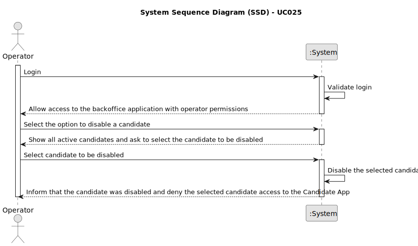

# UC025 - As Operator, I want to disable a candidate

## 1. Requirements Engineering

### 1.1. Use Case Description

> As Operator, I want to disable a candidate so that he/she can't access the Candidate App.

---

### 1.2. Customer Specifications and Clarifications

**From the specifications document:**

- The operator must be able to register, enable and disable candidates.
- The operator must be able to select the candidate to disable from a list of active candidates.
- After being disabled, the candidate must not be able to access the Candidate App.
- The operator must be informed if the candidate was successfully disabled or not.

**From the client clarifications:**

> **Question:** What is the candidate enable/disable?
> 
> **Answer:** Refers to disabling the candidate's access to the system (i.e., Candidate App)

> **Question:** Would the client like two different menus to be created, with each menu responsible for either activating or deactivating candidates?
> 
> **Answer:** I have no specific requirements for the UX/UI, but I want it to follow best practices.

---

### 1.3. Acceptance Criteria

> AC025.1: The operator must be able to disable a candidate by selecting which candidate to disable.
>
> AC025.2: Only active candidates can be disabled.
> 
> AC025.3: The operator must be informed if the candidate was successfully disabled or not.
> 
> AC025.4: Access must only be denied to the Candidate App.
> 
> AC025.5: There must exist a Candidate entity related to the user liable to be disabled.

---

### 1.4. Found out Dependencies

* This Use Case is relative to US 2000b, which is related to the backoffice users management functionality.
* It relates to the following Use Cases as well:
  - [UC001](../../../SPRINT_B/UC001/README.md) - As Admin, I want to be able to register users of the backoffice.
  - [UC024](../../UC024/README.md) - As Operator, I want to be able to enable candidates.

### 1.5 Input and Output Data

**Input Data:**
- Selected data:
	- Candidate to be disabled

**Output Data:**
- List of candidates liable to be disabled (active candidates)
- Success or failure of the operation

### 1.6. System Sequence Diagram (SSD)

### 1.7 Other Relevant Remarks

- As said earlier, the user management functionality depends on the system's ability to authenticate users and manage roles appropriately.