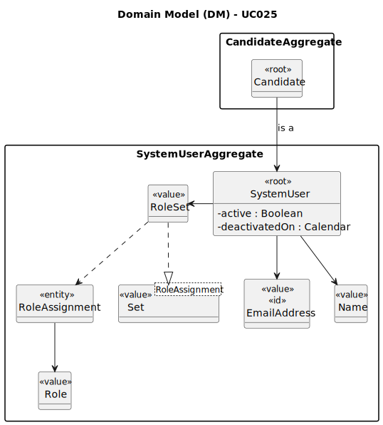

# UC025 - As Operator, I want to disable a candidate

## 2. Analysis

### 2.1. Relevant Domain Model Excerpt

Part of the following diagram was extracted from the EAPLI framework (provided by the course's teachers).

### 2.2. Process Specification

#### 2.2.1. Normal Flow
1. **Authenticate Operator**: Verify that the Operator is logged in with appropriate permissions.
2. **Access User Management Interface**: Operator navigates to the user management section of the backoffice.
3. **Select the Option to Disable Candidates**: Operator selects the option to disable candidates.
4. **List Active Candidates**: The system lists all active candidates (candidates who can access, at that moment, the Candidate App).
5. **Select Candidate to Disable**: Operator selects the candidate to disable.
6. **Disable Candidate**: The system denies the selected candidate access to the Candidate App (by inactivating him/her).

#### 2.2.2. Exceptional Flows
- **EF025.1**: If there is no data, the system shall display a message indicating that there are no active candidates to list.
- **EF025.2**: If there is an error retrieving the data, the system shall display an error message and prompt the Operator to try again later.

### 2.3. Functional Requirements Reevaluation
- **FR025.1**: The system shall give the operator the option to disable candidates.
- **FR025.2**: Only active candidates should be listed to be disabled.
- **FR025.3**: The system shall deny the selected candidate access to the Candidate App.

### 2.4. Non-functional Requirements Specification
- **Security**: Assess encryption standards for transmitting user credentials.
- **Performance**: Ensure user listing processes complete within acceptable time limits, maintaining system responsiveness.
- **Usability**: Interface should be intuitive, guiding the Operator smoothly through the listing process with clear instructions and error handling.

### 2.5. Data Integrity and Security
- **Authorized Access**: Ensure that user data is stored securely and that only authorized users (in this case, the operator) can access it.

### 2.6. Interface Design
- The interface will follow the EAPLI framework's design patterns, providing a user-friendly experience for the Operator.

### 2.7. Risk Analysis
- **R025.1**: Unauthorized Access to User Data
  - **Mitigation**: Implement validation checks within the system to ensure that only the Operator can list active candidates and disable them.

### 2.8. Decisions
- **D025.1**: Create a "Candidate" entity to represent the users who are candidates (contrary to what was previously decided, where the "User" entity was used for all users who were candidates).