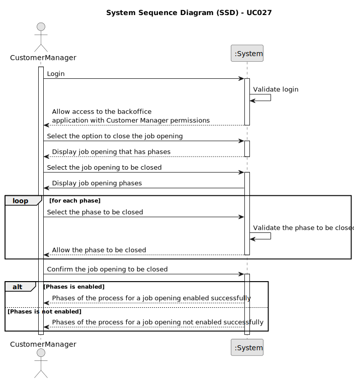

# UC027 - As Customer Manager, I want to close phases of the process for a job opening

## 1. Requirements Engineering

### 1.1. Use Case Description

> As Customer Manager, I want to close phases of the process for a job opening.
> Exists status for a job opening, which can be COMPLETED, IN_PROGRESS and PENDING.
> The phases are sequential and the closing of a phase should automatically open the next one.
---

### 1.2. Customer Specifications and Clarifications

**From the specifications document:**

- The recruitment process for a job opening follows a sequence of phases, such as:
	- Application
	- Screening
	- Interviews
	- Analysis
	- Result
- The customer manager is responsible to setup the process, defining the dates for the phases and if the process includes interviews.

**From the client clarifications:**

> **Question:** Quando o Customer Manager deseja abrir ou fechar uma fase de recrutamento, este deve ter a oportunidade de escolher qual fase deseja abrir ou fechar, ou automaticamente ele avança para a próxima fase, isto é fecha a fase atual e abre a seguinte.
>
> **Answer:** ...a ideia desta US é permitir avançar nas fases de um job opening. As fases devem ser sempre sequenciais. Podemos considerar que o fecho de uma fase resulta na abertura da fase seguinte (e o avançar para a fase seguinte, significa fechar a anterior). Não deve ser possível “saltar” fases, a não ser fases que não façam parte do processo (por exemplo, se não tiver entrevistas).

> **Question:** Gostaria de saber em quê que consiste abrir ou fechar as fases de uma job opening, tendo em conta a US1007 as datas já foram definidas para cada fase.
> 
> **Answer:** Esta US permite que o processo mude de fase (tipicamente para avançar no processo). As fases têm datas mas, como referido em Q16, podemos “ativar” uma fase mesmo que ainda não estejamos no seu intervalo temporal. As datas das fases são “indicativas”, no sentido em que sugerem, em particular ao Customer Manager, como gerir temporalmente o processo. Existem “operações” que devem acontecer quando a fase respetiva esta “ativa”.

> **Question:** No ultimo sprint foi definido as datas em que começa cada fase de uma job opening, neste é possivel fechar e abrir fases. A minha pergunta seria a seguinte, caso se queira fechar uma fase antes da seguinte começar, o inicio dessa seguinte fase é antecipado? No cenário que já tenho passado a data de inicio de uma fase y tendo a x (antecessora) sido fechado, caso se queira re-abrir a fazer x, é possivel? Ou o sistema deve proibir essa tentativa visto violar as datas definidas?
> 
> **Answer:** A “mudança” de fases para “recuar” deve ser possível caso a fase que se deseje “abandonar” ainda não esteja, de facto, a ser “executada/ativa”. Por exemplo, se estou na fase de screening e já comecei a verificar requisitos de candidatos não faz sentido poder “regressar” à fase de application. Mas se eu estava na fase de application e decidi passar para a próxima (de screening) e passado algum tempo quero regressar à anterior (por exemplo, porque me enganei e ainda estou a receber candidaturas), devo poder faze-lo se ainda não tiver feito nenhuma “operação/processamento” especifico da fase de screening. No que se refere ao avançar deve-se aplicar um principio semelhante: deve ser possível avançar para a próxima fase se a anterior estiver “concluída”, por exemplo, posso avançar para as entrevistas se o screening estiver concluído, ou seja, se todos os candidatos foram verificados e notificados. Tipicamente/normalmente, as fases são para avançar de forma sequencial.

> **Question:** Relativamente à secção 2.2.1 e às fases do processo de recrutamento, para passarmos para a fase seguinte a anterior tem de fechar ou podemos avançar sem ter a anterior fechada? 
>
> **Answer:** A resposta curta é que as fases devem ser sequenciais e não sobrepostas. Quando fecha uma fase abre a próxima. A US 1007 prevê a definição das fases. A US 1010 prevê a abertura e fecho de fases do processo. A decisão do Customer Manager de fechar uma fase deve assumir que o processo avança para a próxima fase automaticamente (independentemente das datas definidas para as fases).
---

### 1.3. Acceptance Criteria

> AC027.1: If there is a job opening, the Customer Manager can close a phase of the process.
> AC027.2: If there is a job Opening, it is necessary to create phases with a start and end date.
> AC027.3: The Customer Manager can only close a phase if the job opening is in the OPEN state.
> AC027.4: After all phases are COMPLETED, the state of the job opening should be changed to CLOSED.
---

### 1.4. Found out Dependencies

* This Use Case is relative to US 1002, which is related to the backoffice job opening functionality.
* It relates to the following Use Cases as well:
	- [UC016](../../../SPRINT_B/UC016/README.MD) - As Customer Manager, I want to setup the phases of the process for a job opening.

### 1.5 Input and Output Data

**Input Data:**

* Typed data:
	* JobOpening Reference
    * Menu options: 
      - Close the current phase and automatically open the next one;
      - Go back to the previous phase;

**Output Data:**
- Success or failure of the operation

### 1.6. System Sequence Diagram (SSD)

### 1.7 Other Relevant Remarks

