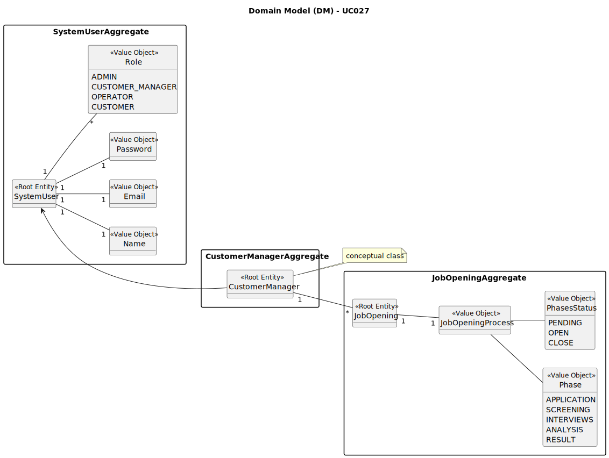

# UC027 - As Customer Manager, I want to close phases of the process for a job opening

## 2. Analysis

### 2.1. Relevant Domain Model Excerpt

The following diagram was extracted from the EAPLI framework (provided by the course's teachers).

### 2.2. Process Specification

#### 2.2.1. Normal Flow
1. **Authenticate Admin**: Verify that the Customer Manager is logged in with appropriate permissions.
2. **Access User Management Interface**: Navigates to the job opening management section of the backoffice.
3. **Select Job Opening**: Choose the specific job opening for which phases need to be closed.
4. **Close Phrases**: Customer Manager closes the desired phases of the job opening.
5. **Update Phrases**: When closing a phase, the next phase is automatically opened.
6. **Feedback**: The system provides feedback to the Customer Manager on the success or failure of the phase closing operation.

#### 2.2.2. Exceptional Flows
- **EF027.1**: If there is a system error during the phase closing process, the system should notify the Customer Manager and provide guidance on how to proceed.

### 2.3. Functional Requirements Reevaluation
- FR027.1: The system shall allow the Customer Manager to select and close phases of the process for a specific job opening.
- FR027.2: The system shall update the status of the job opening process upon phase closure.
- FR027.3: The system shall provide feedback to the Customer Manager on the success or failure of the phase closure process.

### 2.4. Non-functional Requirements Specification
- **Security**: Implement access control mechanisms to ensure that only authorized Customer Managers can close phases of job openings.
- **Performance**: Ensure phase closure processes complete within acceptable time limits to maintain system responsiveness.
- **Usability**:  Interface should be intuitive, guiding the Customer Manager smoothly through the phase closure process with clear instructions and error handling.

### 2.5. Data Integrity and Security
- Data integrity measures should ensure that phase closure actions are accurately recorded and reflected in the system without compromising data consistency.
- Security measures should prevent unauthorized access to phase closure functionality and protect sensitive job opening data.

### 2.6. Interface Design
- The interface should provide an intuitive and efficient workflow for selecting and closing phases of job openings, with clear indications of success or failure.

### 2.7. Risk Analysis
- **R001.1**: System Error During Phase Closure
    - **Mitigation**: Implement error handling mechanisms to notify the Customer Manager of any system failures and provide guidance on how to proceed.

### 2.8. Decisions
- **D027.1**: Use role-based access control for phase closure functionality, restricting access to authorized Customer Managers only.
- **D027.2**: Use the provided domain model as a reference for implementing phase closure functionality.