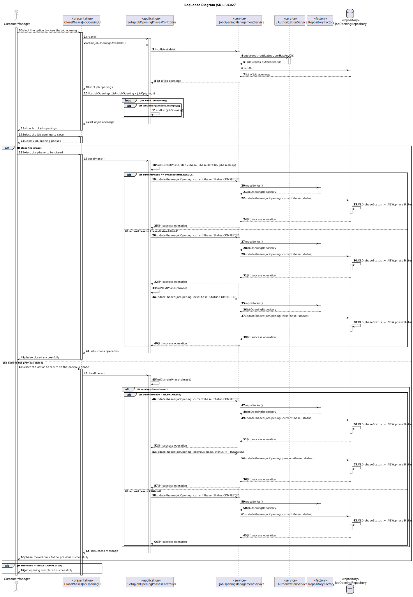

# UC027 - As Customer Manager, I want to close phases of the process for a job opening

## 3. Design - Use Case Realization

### 3.1. Rationale

| Interaction ID                                                            | Question: Which class is responsible for...                       | Answer                          | Justification (with patterns)                                                                                             |
|:--------------------------------------------------------------------------|:------------------------------------------------------------------|:--------------------------------|:--------------------------------------------------------------------------------------------------------------------------|
| Step 1: Login (as Customer Manager)                                       | ... running the application's console?                            | BaseApplication                 | Pure Fabrication: BaseApplication is a class created with the purpose of running a console in our application.            |
|                                                                           | ... showing the backoffice console to do login?                   | BaseBackoffice                  | Pure Fabrication: BaseBackoffice is a class created with the purpose of showing the backoffice console.                   |
|                                                                           | ... showing the login menu?                                       | LoginUI                         | Pure Fabrication: LoginUI is a class created with the purpose of showing the login menu.                                  |
| Step 2: Validate login (as Customer Manager)                              | ... validating the login credentials?                             | CredentialHandler               | Service: CredentialHandler is a class that provides the service of validating login credentials.                          |
|                                                                           | ... showing the login (in)success message?                        | LoginUI                         | Pure Fabrication: LoginUI is a class created with the purpose of showing the login success message.                       |
| Step 3: Allow access to the backoffice application with admin permissions | ... giving admin permissions to logged user?                      | CredentialHandler               | Service: CredentialHandler is a class that provides the service of validating login credentials.                          |
| Step 4: Select the option to close the job opening                        | ... showing the user creation console?                            | ClosePhasesJobOpeningUI         | Pure Fabrication: AddUserUI is a class created with the purpose of showing the user creation console.                     |
|                                                                           | ... controlling the flow of the use case?                         | SetupJobOpeningPhasesController | Controller: SetupJobOpeningPhasesController is a class created with the purpose of controlling the flow of the use case.  |
|                                                                           | ... ensure customer manager has permissions to create a new user? | AuthorizationService            | Service: AuthorizationService is a class that provides the service of validating login credentials.                       |
| Step 5: Display job opening that has phases                               | ... communicating with user?                                      | ClosePhasesJobOpeningUI         | Pure Fabrication: ClosePhasesJobOpeningUI is a class created with the purpose of showing the user creation console.       |
|                                                                           | ... ensure the job opening exists and has phases defined?         | JobOpeningService               | Service: JobOpeningService is a class that provides the service of managing job openings.                                 |
|                                                                           | ... display the job opening details including its phases?         | ClosePhasesJobOpeningUI         | Pure Fabrication: ClosePhasesJobOpeningUI is a class created with the purpose of displaying job opening details.          |
| Step 6: Select the phase to be closed                                     | ... ensure the selected phase is valid and can be closed?         | ClosePhasesJobOpeningController | Controller: ClosePhasesJobOpeningController is a class created with the purpose of ensuring phase validity and closure.   |
|                                                                           | ... manage the phases of the job opening?                         | JobOpeningService               | Service: JobOpeningService is a class that provides the service of managing job openings, including phases.               |
| Step 7: Confirm the job opening to be closed                              | ... confirm the closure of the job opening?                       | ClosePhasesJobOpeningUI         | Pure Fabrication: ClosePhasesJobOpeningUI is a class created with the purpose of confirming the closure of a job opening. |
| Step 8: Show (in)success of the operation's message                       | ... show the (in)success message of the operation?                | ClosePhasesJobOpeningUI         | pure Fabrication: ClosePhasesJobOpeningUI is a class created with the purpose of showing (in)success messages.            |

### Systematization ##
 
According to the taken rationale, the conceptual classes promoted to software classes are:

* JobOpening

Other software classes (i.e. Pure Fabrication) identified:

* BaseApplication
* BaseBackoffice
* LoginUI
* CredentialHandler
* ClosePhasesJobOpeningUI
* SetupJobOpeningPhasesController
* AuthorizationService
* JobOpeningService

## 3.2. Sequence Diagram (SD)

## 3.3. Class Diagram (CD)

