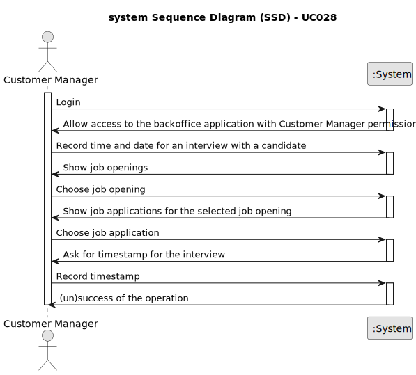

# UC028 — As Customer Manager, I want to record the time and date for an interview with a candidate.

## 1. Requirements Engineering

### 1.1. Use Case Description

> As Customer Manager, I want to record the time and date for an interview with a candidate.

---

### 1.2. Customer Specifications and Clarifications

**From the specifications document:**

**From the client clarifications:**

> **Question:** Uma entrevista pode ter apenas uma questão? US1014, time and date, quer dizer data de inicio e não data
> final? Podem haver entrevistas em paralelo?

> **Answer:** Quanto ao número de perguntas numa entrevista, não está definido nenhum limite inferior ou superior. Ou
> seja, pode haver uma entrevista com apenas 1 pergunta (não fará sentido não ter perguntas). A US1014 refere-se à
> marcação da data de uma entrevista com um candidato. Algo como indicar o dia e a hora (ex: 23 de abril pelas 14:00).
> Em
> relação à marcação de entrevistas “sobrepostas” (com a mesma data de inicio), neste momento, seria algo a permitir (
> pode, por exemplo, o customer manager delegar noutra pessoa a condução da entrevista). Isso não invalida que devam
> validar se as entrevistas ocorrem dentro da fase das entrevistas.

> **Question:** Em relação à marcação da intervista, só deve ser possível marcar esta data quando? Só será possível
> marcar a entrevista quando a fase de recrutamento se encontrar na fase de intervista? Ou será possivel marcar noutras
> fases anteriores?

> **Answer:** Por mim pode ser possível marcar as entrevistas antes mas deve-se ter em atenção se o candidato “passou” o
> screening. Não faz sentido marcar uma entrevista para um candidato que não foi aceite. Tenham em atenção este tipo de
> aspetos.

> **Question:** In the us "US 1014 - As Customer Manager, I want to record the time and date for an interview with a
> candidate." Is it possible to schedule interviews for any day and time or we must take into account weekends, working
> hours and holidays, for example?

> **Answer:** The system should display the day of the week for the selected date. But the system should accept any
> valid date.

> **Question:** Em relação à marcação de uma entrevista com um candidato, deve ser possível marcar mais do que uma
> entrevista por candidatura?

> **Answer:** O sistema nesta fase está pensado para apenas suportar uma entrevista por job opening por isso não faz
> muito sentido marcar mais do que uma entrevista para um candidato a não ser para remarcar a mesma entrevista (por
> exemplo, o candidato faltou justificadamente a uma entrevista anterior). Neste contexto, eu diria que faz mais sentido
> poder alterar a marcação de uma entrevista do que marcar mais do que uma entrevista para o mesmo candidato.

> **Question:**

> **Answer:**
 
---

### 1.3. Acceptance Criteria

>
 
---

### 1.4. Found out Dependencies

* This Use Case is relative to US

### 1.5 Input and Output Data

**Input Data:**

- Typed data:
    - Timestamp of interview
- Automatic data:
    - None
- Selected data:
    - Job Application

**Output Data:**

- Success or failure of the operation

### 1.6. System Sequence Diagram (SSD)

### 1.7 Other Relevant Remarks

- As said earlier, the user management functionality depends on the system's ability to authenticate users and manage
  roles appropriately.