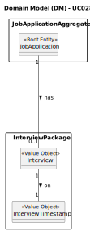

# UC028 — As Customer Manager, I want to record the time and date for an interview with a candidate.

## 2. Analysis

### 2.1. Relevant Domain Model Excerpt

The following diagram was extracted from the EAPLI framework (provided by the course's teachers).

### 2.2. Process Specification

#### 2.2.1. Normal Flow
1. The Customer Manager selects the option to record the time and date for an interview with a candidate.
2. The system requests the Job Application to which the interview will be scheduled.
3. The Customer Manager selects the Job Application.
4. The system requests the timestamp for the interview.
5. The Customer Manager provides the timestamp.
6. The system saves the timestamp and notifies the Customer Manager of the successful operation.

#### 2.2.2. Exceptional Flows
- **EF001.1**: If an interview timestamp already exists, the system should notify the Customer Manager.
- **EF002.1**: If the timestamp is invalid, the system should notify the Customer Manager.
- 

### 2.3. Functional Requirements Reevaluation
- **FR001.1**:

### 2.4. Non-functional Requirements Specification
- **Security**: Assess encryption standards for storing and transmitting user credentials.
- **Performance**: Ensure user registration processes complete within acceptable time limits, maintaining system responsiveness.
- **Usability**: Interface should be intuitive, guiding the Admin smoothly through the registration process with clear instructions and error handling.

### 2.5. Data Integrity and Security
- Outline the security measures for data handling, particularly how personal data is protected in line with compliance requirements (e.g., GDPR).

### 2.6. Interface Design
- The interface will follow the EAPLI framework's design patterns, providing a user-friendly experience for the Customer Manager

### 2.7. Risk Analysis
- **R001.1**: System Error During Account Creation
  - **Mitigation**: Implement error handling mechanisms to notify the Customer Manager of any system failures and provide guidance on how to proceed.

### 2.8. Decisions
- **D001.1**: 