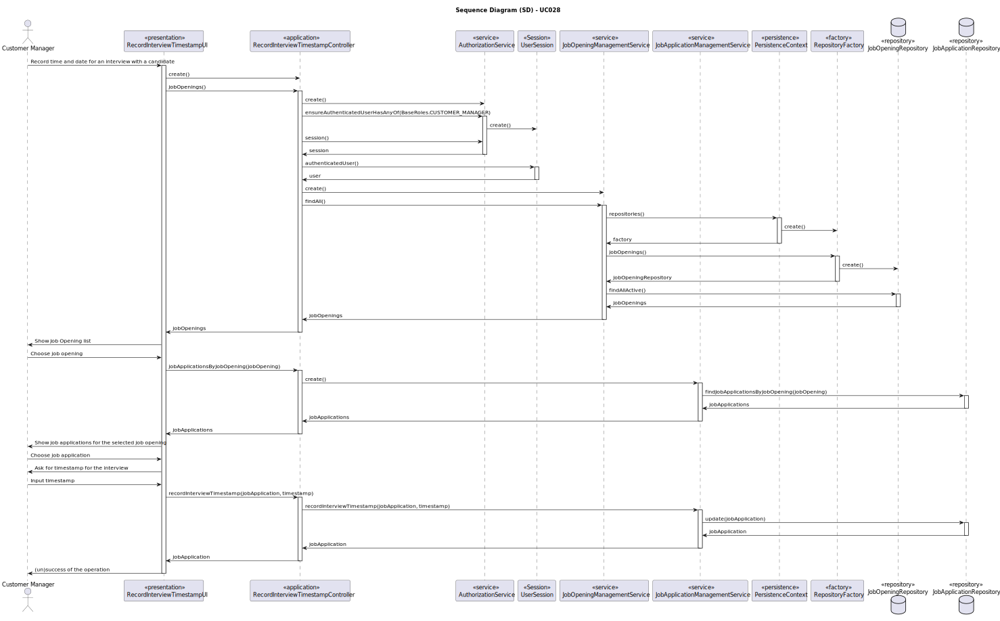
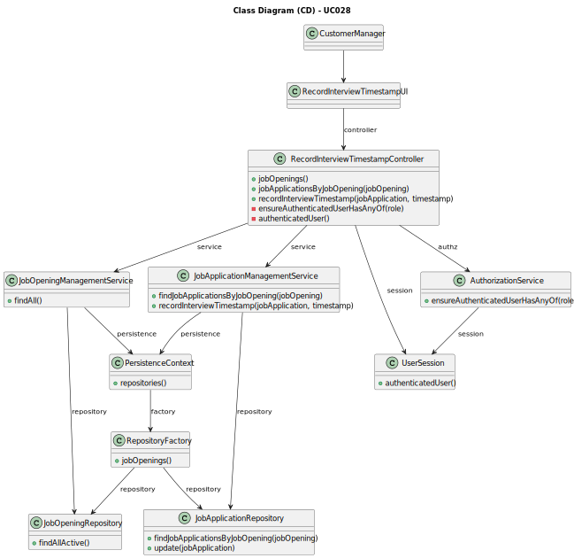

# UC028 — As Customer Manager, I want to record the time and date for an interview with a candidate.

## 3. Design - Use Case Realization

### 3.1. Rationale

| Interaction ID                                                 | Question: Which class is responsible for...                            | Answer                             | Justification (with patterns)                                                                                        |
|:---------------------------------------------------------------|:-----------------------------------------------------------------------|:-----------------------------------|:---------------------------------------------------------------------------------------------------------------------|
| Step 1: Record time and date for an interview with a candidate | ... interacting with the user to record time and date?                 | RecordInterviewTimestampUI         | Pure Fabrication: RecordInterviewTimestampUI is created to handle user interactions for recording interview details. |
|                                                                | ... controlling the flow of the use case?                              | RecordInterviewTimestampController | Controller: It manages the workflow of recording the interview timestamp.                                            |
| Step 2: Retrieve job openings                                  | ... ensuring the user has the right permissions?                       | AuthorizationService               | Service: Ensures the user has the necessary roles (e.g., CUSTOMER_MANAGER) before proceeding.                        |
|                                                                | ... managing the user's session and retrieving the authenticated user? | UserSession                        | Session: Handles authenticated user sessions and information.                                                        |
|                                                                | ... retrieving the list of job openings?                               | JobOpeningManagementService        | Service: Provides functionality to retrieve job openings.                                                            |
|                                                                | ... providing the list of job openings from the database?              | JobOpeningRepository               | Information Expert: Responsible for accessing job openings data in the database.                                     |
| Step 3: Retrieve job applications for selected job opening     | ... retrieving job applications for a specific job opening?            | JobApplicationManagementService    | Service: Provides functionality to retrieve job applications based on job opening.                                   |
|                                                                | ... providing the list of job applications from the database?          | JobApplicationRepository           | Information Expert: Responsible for accessing job applications data in the database.                                 |
| Step 4: Record interview timestamp                             | ... recording the timestamp for the interview?                         | JobApplicationManagementService    | Service: Manages the process of recording interview timestamps for job applications.                                 |
|                                                                | ... updating the job application with the new timestamp?               | JobApplicationRepository           | Information Expert: Responsible for updating job applications in the database.                                       |
| Step 5: Show (un)success of the operation                      | ... showing the (un)success message to the user?                       | RecordInterviewTimestampUI         | Pure Fabrication: Created to show feedback messages to the user.                                                     |

### Systematization ##

According to the taken rationale, the conceptual classes promoted to software classes are:

* `AuthorizationService`
* `UserSession`
* `JobOpeningManagementService`
* `JobOpeningRepository`
* `JobApplicationManagementService`
* `JobApplicationRepository`

Other software classes (i.e. Pure Fabrication) identified:

* `RecordInterviewTimestampUI`
* `RecordInterviewTimestampController`

## 3.2. Sequence Diagram (SD)

## 3.3. Class Diagram (CD)

