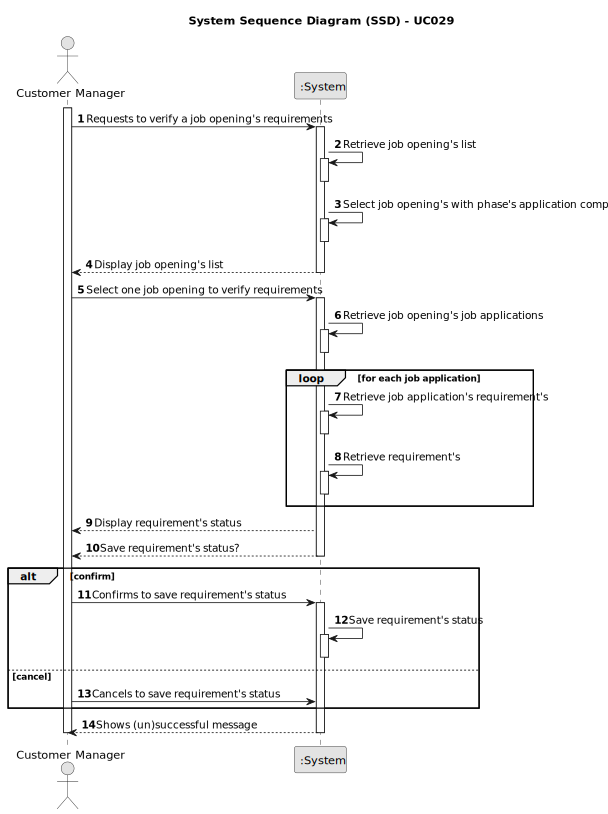

# UC029 - As CM I want to execute the process of verification of requirements of applications for a job opening

## 1. Requirements Engineering

### 1.1. Use Case Description

> As Costumer Manager I want to execute the process of verification of requirements of applications for a job opening

---

### 1.2. Customer Specifications and Clarifications

**From the specifications document:**

- The Costumer Manager is responsible for verify if the applications submitted by the candidates correspond to the requirements of the job opening.

**From the client clarifications:**

> **Question:** Deve ser executado o processo para todos os candidatos ou apenas para alguns (segundo algum critério)?
> 
> **Answer:** Os ficheiros com as respostas aos requisitos vão entrando no sistema gradualmente. Talvez seja mais “simples” que o processo execute (ou seja, faça a verificação dos requisitos) para os candidatos para os quais já foi submetido o ficheiro de requisitos. Nalgum momento o processo irá executar com todos os candidatos já com os ficheiros de requisitos submetidos.

---

### 1.3. Acceptance Criteria

> AC0029.1: It should be possible to execute all the applications for that job opening.
>
> AC0029.2: The process must run for candidates who have already submitted the requirements file.
> 
> AC0029.3: Only the Job openings with phase closed can be verified.

---

### 1.4. Found out Dependencies

* There's a dependency to the UC006 - "As Customer Manager, I want to register a job opening", the US2002 - "As Operator, I want to register an application of a candidate for a job opening and
  import all files received.", and the UC018 - "As Customer Manager, I want to select the requirements specification to be used
  for a job opening" because the verification process depends on the existence of the job opening, the applications, and the requirements specification.

### 1.5 Input and Output Data

**Input Data:**
- Typed data:
	* n/a
  
- Automatic data:
	- * n\a
  
- Selected data:
	- Job Opening
    - Job Applications
   

**Output Data:**
- Success or failure of the operation

### 1.6. System Sequence Diagram (SSD)

### 1.7 Other Relevant Remarks

- The verification process should be executed for all applications that have the requirements file submitted.