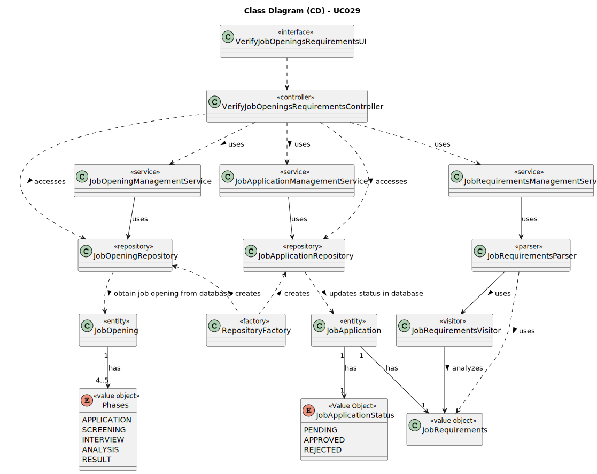

# UC029 - As Customer Manager, I want to execute the process of verification of requirements of applications for a job opening.

## 3. Design - Use Case Realization

### 3.1. Rationale

| Interaction ID                                                                       | Question: Which class is responsible for...                                                | Answer                                  | Justification (with patterns)                                                                                                                |
|:-------------------------------------------------------------------------------------|:-------------------------------------------------------------------------------------------|:----------------------------------------|:---------------------------------------------------------------------------------------------------------------------------------------------|
| Step 1: Login (as Customer Manager)                                                  | ... running the application's console?                                                     | BaseApplication                         | Pure Fabrication: BaseApplication is a class created with the purpose of running a console in our application.                               |
|                                                                                      | ... showing the backoffice console to do login?                                            | BaseBackoffice                          | Pure Fabrication: BaseBackoffice is a class created with the purpose of showing the backoffice console.                                      |
|                                                                                      | ... showing the login menu?                                                                | LoginUI                                 | Pure Fabrication: LoginUI is a class created with the purpose of showing the login menu.                                                     |
| Step 2: Validate login (as Customer Manager)                                         | ... validating the login credentials?                                                      | CredentialHandler                       | Service: CredentialHandler is a class that provides the service of validating login credentials.                                             |
|                                                                                      | ... showing the login (in)success message?                                                 | LoginUI                                 | Pure Fabrication: LoginUI is a class created with the purpose of showing the login success message.                                          |
| Step 3: Allow access to the backoffice application with customer manager permissions | ... giving admin permissions to logged user?                                               | CredentialHandler                       | Service: CredentialHandler is a class that provides the service of validating login credentials.                                             |
| Step 4: Select a Job opening                                                         | ... communicating with user?                                                               | VerifyJobOpeningsRequirementsUI         | Pure Fabrication: VerifyJobOpeningsRequirementsUI is a class created with the purpose of showing the user creation console.                  |
|                                                                                      | ... obtaining all job openings available?                                                  | JobOpeningRepository                    | Information Expert: JobOpeningRepository is a class created with the purpose of obtaining all job openings available.                        |
|                                                                                      | ... ensure the job opening has an application phase complete?                              | JobOpeningManagementService             | Service: JobOpeningManagementService is a class that provides the service of job opening's phase.                                            |
| Step 5: Evaluate Job application's interviews                                        | ... obtaining all job opening's applications?                                              | JobApplicationRepository                | Information Expert: JobApplicationRepository is a class created with the purpose of obtaining all job opening's applications available.      |
|                                                                                      | ... controlling the flow of the use case?                                                  | VerifyJobOpeningsRequirementsController | Controller: VerifyJobOpeningsRequirementsController is a class created with the purpose of controlling the flow of the use case.             |
|                                                                                      | ... ensure customer manager has permissions to check job requirements of job applications? | AuthorizationService                    | Service: AuthorizationService is a class that provides the service of validating login credentials.                                          |
|                                                                                      | ... obtaining job application's requirements answers?                                      | JobRequirementsParser                   | Service: JobRequirementsParser is a class that provides the service of obtaining job application's requirements answers.                     |
|                                                                                      | ... obtaining job opening's job requirements solution?                                     | JobRequirementsParser                   | Service: JobRequirementsParser is a class that provides the service of obtaining job application's requirements answers.                     |
| Step 6: Saves applications' rank                                                     | ... record the job applications' status instance is the database?                          | JobApplicationRepository                | Information Expert: JobApplicationRepository is a class created with the purpose of recording job application instances in the database.     |
| Step 7: Show (in)success of the operation's message                                  | ... show the (in)success message?                                                          | VerifyJobOpeningsRequirementsUI         | Pure Fabrication: VerifyJobOpeningsRequirementsUI is a class created with the purpose of showing the verification operation success message. |

### Systematization ##

According to the taken rationale, the conceptual classes promoted to software classes are:

* JobRequirementsParser
* JobRequirementsVisitor

Other software classes (i.e. Pure Fabrication) identified:

* BaseApplication
* BaseBackoffice
* CredentialHandler
* AuthorizationService
* VerifyJobOpeningsRequirementsUI
* VerifyJobOpeningsRequirementsController
* JobOpeningManagementService
* JobApplicationManagementService
* JobRequirementsManagementService

## 3.2. Sequence Diagram (SD)

## 3.3. Class Diagram (CD)

