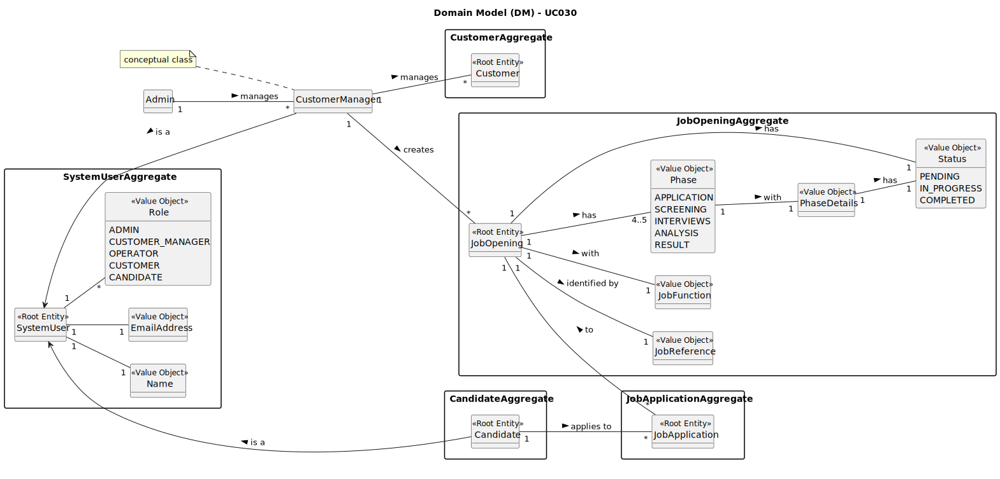

# UC030 - As Customer Manager, I want the system to notify candidates, by email, of the result of the verification process

## 2. Analysis

### 2.1. Relevant Domain Model Excerpt

The following diagram was extracted from the EAPLI framework (provided by the course's teachers).

### 2.2. Process Specification

#### 2.2.1. Normal Flow
1. **Authenticate Admin**: Verify that the Customer Manager is logged in with appropriate permissions.
2. **Access User Management Interface**: Navigates to the job opening management section of the backoffice.
3. **Select Job Opening**: Choose the specific job opening for which phases need to be closed.
4. **Close Phrases**: Customer Manager closes the desired phases of the job opening.
5. **Update Phrases**: When closing a phase, the next phase is automatically opened.
6. **Feedback**: The system provides feedback to the Customer Manager on the success or failure of the phase closing operation.
7. **Notify Candidates**: The system sends an email to the candidates informing them of the result of the verification process.
8. **Record Notification**: Record that the notification has been made for process management purposes.
9. **Feedback**: The system provides feedback to the Customer Manager on the success or failure of the phase closing and notification operation.

#### 2.2.2. Exceptional Flows
- **EF030.1**: If the email is not sent, the system must notify the Customer Manager and log the error.

### 2.3. Functional Requirements Reevaluation
- **FR030.1**: The system shall notify candidates by email about the results of the verification process.
- **FR030.2**: The system shall record that the notification has been made. 
- **FR030.3**: The system shall provide feedback to the Customer Manager on the success or failure of the phase closure and notification process.

### 2.4. Non-functional Requirements Specification
- **Security**: Implement access control mechanisms to ensure that only authorized Customer Managers can send notifications.
- **Performance**: Ensure the notification process completes within acceptable time limits to maintain system responsiveness.
- **Usability**: Interface should be intuitive, guiding the Customer Manager smoothly through the notification process with clear instructions and error handling.

### 2.5. Data Integrity and Security
- Data integrity measures should ensure that notification actions are accurately recorded and reflected in the system without compromising data consistency.
- Security measures should prevent unauthorized access to notification functionality and protect sensitive candidate data.

### 2.6. Interface Design
- The interface will follow the EAPLI framework's design patterns, providing a user-friendly experience for the Customer Manager.
- The interface should provide an intuitive and efficient workflow for selecting candidates and sending notifications, with clear indications of success or failure.

### 2.7. Risk Analysis
- **R030.1**: System Error During Notification
    - **Mitigation**: Implement error handling mechanisms to notify the Customer Manager of any system failures and provide guidance on how to proceed.
- **R030.2**: Unauthorized Access to Notification Functionality
  - **Mitigation**: Implement secure encryption standards for storing and transmitting user credentials to prevent unauthorized access.

### 2.8. Decisions
- **D030.1**: Use role-based access control for notification functionality, restricting access to authorized Customer Managers only.
- **D030.2**: Utilize the system's email notification service to send updates to candidates.
- **D030.3**: Implement a logging mechanism to record the success or failure of email notifications for audit purposes.
- **D030.4**: Use the provided domain model as a reference for implementing notification functionality.