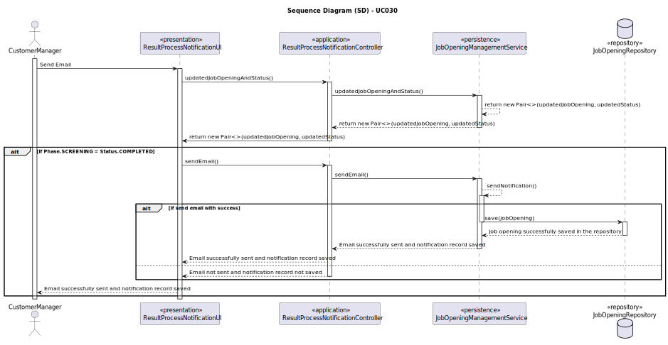
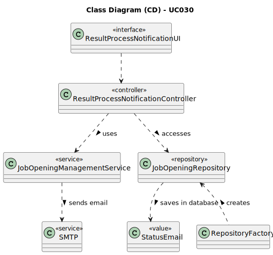

# UC030 - As Customer Manager, I want the system to notify candidates, by email, of the result of the verification process

## 3. Design - Use Case Realization

### 3.1. Rationale

| Interaction ID                                       | Question: Which class is responsible for...         | Answer                              | Justification (with patterns)                                                                                                        |
|:-----------------------------------------------------|:----------------------------------------------------|:------------------------------------|:-------------------------------------------------------------------------------------------------------------------------------------|
| Step 1: Notify Candidates                            | ... triggering the notification process?            | ResultProcessNotificationController | Controller: ResultProcessNotificationController is responsible for controlling the flow of the notification process.                 |
|                                                      | ... searching information about candidate?          | JobApplication                      | Information Expert: JobApplication is responsible for holding and providing candidate information.                                   |
|                                                      | ... fetching the list of candidates?                | JobApplicationRepository            | Information Expert: JobApplicationRepository provides access to job application data, including candidate details.                   |
| Step 2: Send Email                                   | ... sending the email to candidates?                | JobOpeningManagementService         | Service: JobOpeningManagementService provides the service of sending emails to candidates.                                           |
|                                                      | ... creating the email content?                     | JobOpeningManagementService         | Service: JobOpeningManagementService is responsible for generating the email content.                                                |
|                                                      | ... providing information for the email content?    | Phase and JobOpening                | Information Expert: Phase and JobOpening provide the necessary information for creating the email content.                           |
| Step 3: Save Notification Record                     | ... saving the notification record in the database? | JobApplicationRepository            | Information Expert: JobApplicationRepository is responsible for saving notification records in the database.                         |
| Step 4: Show (in)success of the operation's message  | ... showing the notification (in)success message?   | ResultProcessNotificationUI         | Pure Fabrication: ResultProcessNotificationUI is responsible for showing the success or failure message of the notification process. |

### Systematization ##

According to the taken rationale, the conceptual classes promoted to software classes are:

* Phase
* JobApplication
* JobOpening
* Status

Other software classes (i.e. Pure Fabrication) identified:

* ResultProcessNotificationController
* JobApplicationRepository
* JobOpeningManagementService
* ResultProcessNotificationUI

## 3.2. Sequence Diagram (SD)

## 3.3. Class Diagram (CD)

