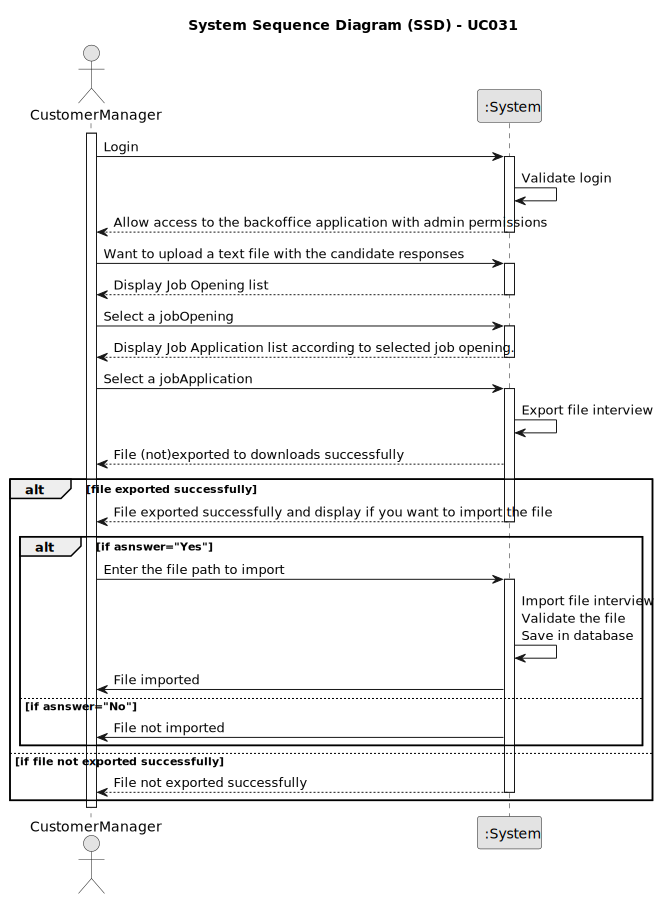

# UC031 - As Customer Manager, I want to upload a text file with the candidate responses for an interview

## 1. Requirements Engineering

### 1.1. Use Case Description

> As Customer, I want to upload a text file with the candidate responses for an interview so that I can analyze the responses and make a decision.

---

### 1.2. Customer Specifications and Clarifications

**From the specifications document:**

- **Interviews:** This phase is not mandatory, but is common. During this phase, accepted
  candidates may be interviewed. Results for the interviews are registered for further
  analysis.

**From the client clarifications:**

> **Question:** US1017/1018 – ...relação ao processamento dos ficheiros de respostas dos candidatos para a entrevista. No caso de upload de um ficheiro, se a pergunta que requer um número como resposta for preenchida com um formato inválido, por exemplo, uma letra, devemos considerar isso como um formato inválido na US 1017 (e pedir para o user voltar a dar upload a um ficheiro válido) ou devemos, na US1018, considerar que está incorreta e atribuir 0 pontos automaticamente para essa resposta inválida? Isto é, na US 1017, devemos apenas verificar o formato do ficheiro ou devemos verificar também se as respostas são preenchidas com o tipo de dados correto?
>
> **Answer:** O caso mencionado deve ser considerado um erro de validação do ficheiro (ou seja, o ficheiro submetido não corresponde à gramática definida).

> **Question:** Em termos "upload" certamente passa pela verificação com a gramática e após sucesso colocar o ficheiro das respostas da entrevista junto da pasta com os ficheiros da "Application" certo?
> 
> **Answer:** Sim, a sintaxe deve ser verificada e, se tudo estiver correto, o ficheiro deve ser “importado” para o sistema de forma a que possa ser usado posteriormente, por exemplo, no âmbito da US 1018. Quanto a solução para o “importar” faz parte da vossa solução. Idealmente julgo que faria sentido que ficasse integrado na base de dados. Não sendo possível, penso que é aceitável que fique numa pasta/diretório de um servidor.

---

### 1.3. Acceptance Criteria

> AC031.1: If the file is not in the correct format, the system must inform the user with "File not importaded".
>
> As a Customer Manager, I want to upload a text file with candidate responses from an interview to analyze the responses and make decisions.
>
> The template file for the candidate responses is generated by the Customer Manager (UC020).
>
> The interview model is selected for upload based on the job opening selected.
>
> The interview model is located in the LPROG/InterviewModels/JobOpeningReference folder.
>
> The file must be in the following format:
```
INTERVIEW "Template 1"
DATEQUES [DD/MM/YYYY] "When it's the last day of the year 2022?" [10];
ANS: 
```
> After the interview, the file is imported to the SCOMP/files/fileBotFiles/Candidate Email/interview.txt folder.
---

### 1.4. Found out Dependencies

* This Use Case is relative to US 1002, which is related to the backoffice job opening functionality.* It relates to the following Use Cases as well:
  - [UC019](../../UC019/README.md) - As Customer Manager, I want to select the interview model to use for the interviews of a job opening (for their evaluation/grading)
  - [UC020](../../UC020/README.md) - As Customer Manager, I want to generate and export a template text file to help
	collect the candidate answers during the interviews.

### 1.5 Input and Output Data

**Input Data:**

* Typed data:
	- File/Path with the candidate responses for the interview
	
* Selected data:
	- Job Opening
	- Job Application

**Output Data:**
- Success or failure of the operation

### 1.6. System Sequence Diagram (SSD)



### 1.7 Other Relevant Remarks

- The grammer of the file must be validated after importing it into the system.