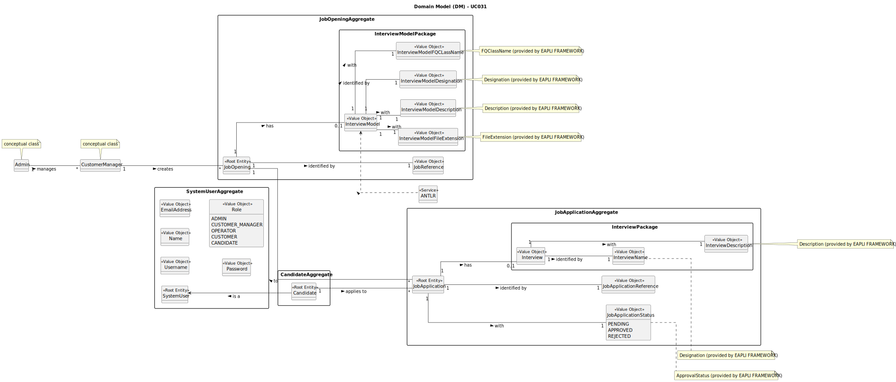

# UC031 - As Customer Manager, I want to upload a text file with the candidate responses for an interview

## 2. Analysis

### 2.1. Relevant Domain Model Excerpt

The following diagram was extracted from the EAPLI framework (provided by the course's teachers).

### 2.2. Process Specification

#### 2.2.1. Normal Flow
1. **Authenticate Customer Manager**: Verify that the Customer Manager is logged in with appropriate permissions. 
2. **Access Interview Response Upload Interface**: The Customer Manager navigates to the interview response upload section in the back office. 
3. **Select Job Opening**: The Customer Manager selects the job opening for which the interview responses are being uploaded.**Upload Text File**: The Customer Manager uploads a text file containing the candidate responses.
4. **Select Job Application**: The Customer Manager selects the job application for which the interview responses are being uploaded.
5. **Validate File Format**: The system validates the format and content of the text file.
6. **Parse and Store Responses**: Upon successful validation, the system parses the text file and stores the responses.
7. **Confirmation**: Display a success message to the Customer Manager or an error message if any step fails.

#### 2.2.2. Exceptional Flows
- **EF031.1**: If the text file format is incorrect, the system informs the Customer Manager and requests a correct file.
- **EF031.2**: If there is a system error during file parsing or storage, notify the Customer Manager of the failure and suggest retrying.

### 2.3. Functional Requirements Reevaluation
- **FR031.1**: The system shall allow the Customer Manager to upload a text file with candidate responses for an interview.
- **FR031.2**: The system shall validate the uploaded text file for correct format and required content.
- **FR031.3**: The system shall parse the validated text file and store the candidate responses in the database.
- **FR031.4**: The system shall provide feedback to the Customer Manager on the success or failure of the upload process.
- **FR031.5**: The system shall handle exceptions such as incorrect file formats or system errors with appropriate error messages.

### 2.4. Non-functional Requirements Specification
- **Security**: Ensure secure transmission of the text file and safe storage of candidate responses.
- **Performance**: The upload and processing of the text file should complete within acceptable time limits.
- **Usability**: The interface should be intuitive, providing clear instructions and feedback.

### 2.5. Interface Design
- The interface will follow the EAPLI framework's design patterns, providing a user-friendly experience for the Customer Manager.

### 2.6. Risk Analysis
- **R031.1**: Incorrect file format 
    - **Mitigation**: Implement robust validation checks to ensure file format and content correctness before processing.
- **R031.2**: System error during file processing
  - **Mitigation**: Implement comprehensive error handling and logging mechanisms to identify and resolve issues promptly.

### 2.7. Decisions
- **D031.1**: Confirm the validity of the uploaded text file, ensuring that the format and content comply with the specified requirements.
- **D031.2**: Utilize an automated validation process to verify the integrity and correctness of the data in the text file before proceeding with storage.
- **D031.3**: Implement error handling mechanisms to inform the Customer Manager of any failures in the file upload or validation process.
- **D031.4**: Use the EAPLI framework classes and methods to facilitate the implementation and integration of this process into the existing system.
- **D031.5**: Adopt the provided domain model as a reference to ensure that the response upload process is aligned with the system's data structure and requirements.
-- **D031.6**: Ensure that candidate responses are stored securely and that the data is accessible for subsequent evaluation according to the criteria defined in the interview models and job requirement specifications.