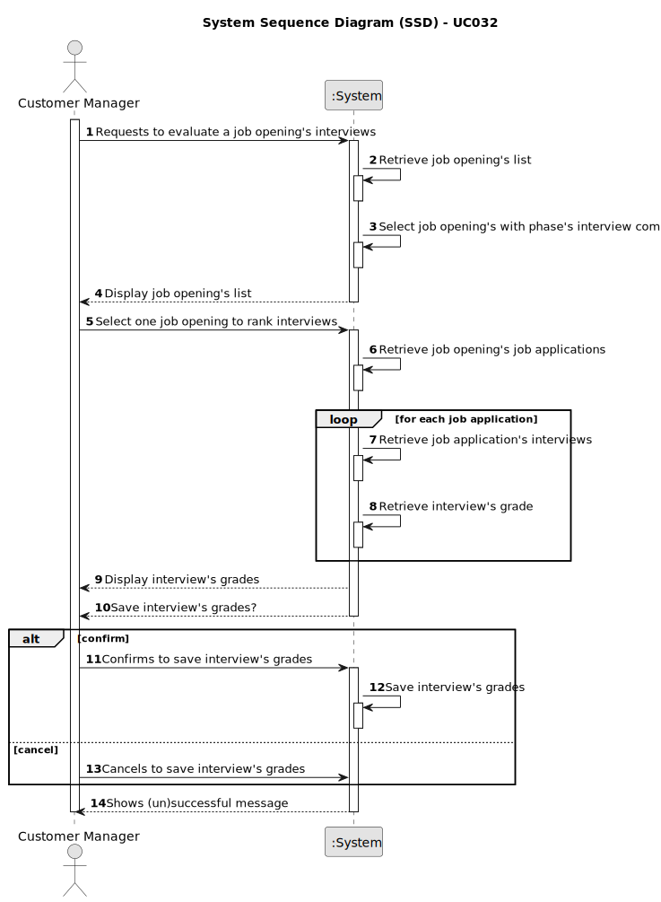

# UC032 - As Customer Manager, I want to execute the process that evaluates (grades) the interviews for a job opening.

## 1. Requirements Engineering

### 1.1. Use Case Description

> As Customer Manager, I want to choose a job opening, with interview phase already done, and execute the process that
> evaluates (grades) the interviews of their job applications.

---

### 1.2. Customer Specifications and Clarifications

**From the specifications document:**

- The Customer Manager will choose a job opening that has the interview phase already done.
- The Customer Manager will be able to evaluate the interviews of the job opening's application.
- The System will grade automatically the interviews based on the Interview Model solutions.

**From the client clarifications:**

> **Question:** US1018 – Relativamente à US1018, após a execução do processo de avalição de todas as entrevistas da job 
> opening, a fase em que esta se encontra deve ser automaticamente mudado para "Result" ou deve ser mantida em "Analysis" 
> e apenas pode ser mudada pela execução da US1010?
> 
> **Answer:** A US1018 não deve alterar a fase actual. A US1010 permite fazer a mudança de fases do processo de 
> recrutamento.
 
> **Question:** US1017/1018 – O nosso grupo tem uma dúvida em relação ao processamento dos ficheiros de respostas dos 
> candidatos para a entrevista. No caso de upload de um ficheiro, se a pergunta que requer um número como resposta for 
> preenchida com um formato inválido, por exemplo, uma letra, devemos considerar isso como um formato inválido na US 1017 
> (e pedir para o user voltar a dar upload a um ficheiro válido) ou devemos, na US1018, considerar que está incorreta e 
> atribuir 0 pontos automaticamente para essa resposta inválida? Isto é, na US 1017, devemos apenas verificar o formato 
> do ficheiro ou devemos verificar também se as respostas são preenchidas com o tipo de dados correto?
>
> **Answer:** O caso mencionado deve ser considerado um erro de validação do ficheiro (ou seja, o ficheiro submetido não 
> corresponde à gramática definida). 

---

### 1.3. Acceptance Criteria

> AC032.1: The Customer Manager must be able to choose a _only_ job opening that has the interview phase already done.
> 
> AC032.2: The Customer Manager must be able to evaluate the interviews of the job opening's application.
> 
> AC032.3: The System must grade automatically the interviews based on the Interview Model solutions.

---

### 1.4. Found out Dependencies

* This Use Case is relative to US 1000, which is related to the backoffice users management functionality.
* It relates to the following Use Cases as well:
  - [UC022](../../UC022/README.md) - As Customer Manager, I want to rank the candidates for a job opening
  - [UC031](../../UC031/README.md) - As Customer Manager, I want to upload a text file with the candidate responses fo an interview
  - [UC033](../../UC033/README.md) - As Customer Manager, I want to get an ordered list of candidates, using the job interview points (grades), to help me analyze the candidates.
  
### 1.5 Input and Output Data

**Input Data:**
- Selected data:
	- job opening

**Output Data:**
- Success or failure of the operation
- Interview grades for each candidate

### 1.6. System Sequence Diagram (SSD)

### 1.7 Other Relevant Remarks

n/a
