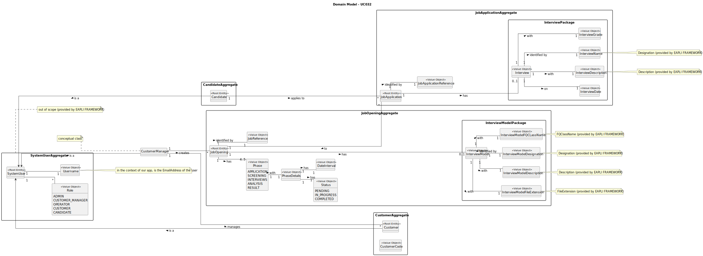

# UC032 - As Customer Manager, I want to execute the process that evaluates (grades) the interviews for a job opening.

## 2. Analysis

### 2.1. Relevant Domain Model Excerpt

### 2.2. Process Specification

#### 2.2.1. Normal Flow

1. **Authenticate Customer Manager**: Verify that the Customer Manager is logged in with appropriate permissions.
2. **Access Job Opening Management Interface**: Customer Manager navigates to the job opening management section of the
   backoffice.
3. **Obtain Job Openings with Phase Interview completed**: The system retrieves the job openings with the interview
   phase completed.
4. **Select Job Opening**: Customer Manager inputs the option with the job opening's reference;
4. **Obtain Job Applications**: The system obtain the job opening's applications and their respective interviews.
5. **System Evaluates Interviews**: The system automatically evaluates the job applications.
6. **Display Interview Grade**: The system displays the interview grade to the Customer Manager.
7. **Save Interview Grade**: On successful evaluation, the system saves the interview grade of the respective job
   application.
8. **Confirmation to Admin**: Display a success message to the Customer Manager upon successful grade's save or error
   messages if
   any step fails.

#### 2.2.2. Exceptional Flows

- **EF032.1**: Customer Manager is not authenticated.
- **EF032.2**: Job Opening does not exist.
- **EF032.5**: System fails to evaluate the interviews.

### 2.3. Functional Requirements Reevaluation

- **FR032.1**: The system shall allow the Admin to register new users by providing their name, email and role(s).
- **FR032.2**: The system shall validate the email address for uniqueness and format compliance.
- **FR032.3**: The system shall automatically generate a secure password for the user.
- **FR032.4**: The system shall create the user account with the provided details and assigned role(s).
- **FR032.5**: The system shall provide feedback to the Admin on the success or failure of the user registration
  process.
- **FR032.6**: The system shall handle exceptions, such as duplicate emails or system errors, with appropriate error
  messages.

### 2.4. Non-functional Requirements Specification

- **NFR032.1**: The system shall provide a user-friendly interface for the Customer Manager to evaluate the interviews.
- **NFR032.2**: The system shall automatically evaluate the interviews based on predefined criteria.
- **NFR032.3**: The system shall provide appropriate feedback to the Customer Manager on the success or failure of the
  interview evaluation process.

### 2.5. Data Integrity and Security

- The system shall ensure data integrity by validating the interview grade before saving it to the database.

### 2.6. Interface Design

- The interface will follow the EAPLI framework's design patterns, providing a user-friendly experience for the Admin.

### 2.7. Risk Analysis

- **R032.1**: The system may fail to evaluate the interviews due to system errors or invalid inputs.
- **R032.2**: The system may not provide appropriate feedback to the Customer Manager on the success or failure of the
  interview
  evaluation process.
- **R032.3**: The system may not handle exceptions, such as duplicate emails or system errors, with appropriate error
  handling.

### 2.8. Decisions

- **D032.1**: The system will automatically evaluate the interviews based on predefined criteria (InterviewModelGrammar.g4).
- **D032.2**: The system will provide appropriate feedback to the Customer Manager on the success or failure of the
  interview evaluation process.