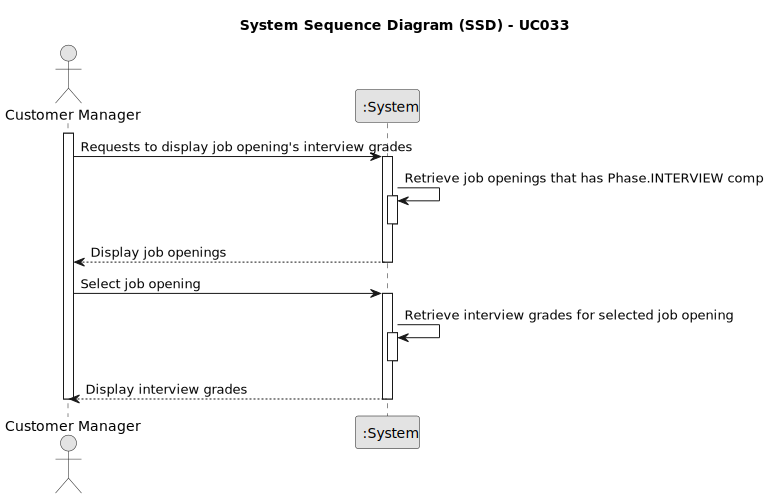

# UC033 - As Customer Manager, I want to get an ordered list of candidates, using the job interview points (grades), to help me analyze the candidates.

## 1. Requirements Engineering

### 1.1. Use Case Description

> The Customer Manager will have the a list of candidates, with the respective grades, to help him analyze the candidates.

---

### 1.2. Customer Specifications and Clarifications

**From the specifications document:**
w
- The Customer Manager manage all the customers and their applications.
- The Customer Manager will select a job opening, which has the phase interview and is on the phase analysis.
- The Candidates will be displayed in descending order. The order is based on the interview grades.

**From the client clarifications:**

> **Question:** Relativamente a esta user story, "US 1019 - As Customer Manager, I want to get an ordered list of 
> candidates, using the job interview points (grades), to help me analyze the candidates.", a lista que pretende é 
> relacionada a uma job opening correto? A maneira de ordenação é ascendente ou quer uma opção que inclua ascendente e 
> descendente?
> 
> **Answer:** Sim, a ordenação é relativa a candidaturas para um job opening. A ordenação deve ser descendente, do que 
> tem maior pontuação para o que tem menor pontuação.
 
> **Question:**Pretende que para uma determinada Job Opening de um cliente meu, retorno uma lista ordenada de candidatos
> e suas notas da entrevista. Penso implementar essa funcionalidade da seguinte forma:
>
> Job Opening : XXX
>
> Nome | Email | Grade
>
> Jane Doe| jane@doe.pt | 85
>
> John Doe | john@doe.pt | 70
>
> Ou seja com ordenação descendente.
>
> Conforme refere, consegue ver numa instancia esta lista, e noutra instancia faz o ranking que achar pertinente.
>
> Acha bem?
> 
> **Answer:** Relativamente ao exemplo que apresenta parece-me que satisfaz o que pretendo.

> **Question:** (...) é mencionado para a listagem ser ordenada descendentemente da nota da entrevista (como 
> mencionado tambem na própria US), no entanto, a questão é, como idealiza a ordenação caso a job opening não possua 
> entrevista?
> 
> **Answer:** Esta US não faz sentido para processos que não tenham entrevista.
 
> **Question:** (...) devemos então apenas permitir a listagem de job openings que tenham entrevista?
> 
> **Answer:** Penso que não percebi bem a referência à listagem de job openings. Esta US não faz sentido para job 
> openings que não tenham entrevista, uma vez que assenta na listagem dos candidatos e dos seus pontos nas entrevista.

> **Question:** Na descrição da user story : " As Customer Manager, I want to get an ordered list of candidates, using 
> the job interview points (grades), to help me analyze the candidates". A intenção "analyze the candidates" impõe alguma 
> mudança/remoção de candidatos no sistema?
> 
> **Answer:** A referência a “analize the candidates” é apenas para passar a ideia que se pretende nesta US que o sistema 
> disponibilize uma forma do Customer Manager conseguir consultar o resultado das entrevistas de forma a ajudar a decidir 
> o ranking dos candidatos. Nada mais. (...)

> **Question:** Nesta user story , a expressão "to help me analyze candidates" ,na descrição da user story , impõe que a 
> job Opening esteja na fase de análise ?
>
> **Answer:** Não vejo isso como uma obrigação, mas penso que faz mais sentido nessa fase admitindo que apenas nessa 
> fase seja garantido que todas as entrevistas foram efetuadas e todos os candidatos “avaliados” pelas entrevistas.

---

### 1.3. Acceptance Criteria

> AC033.1: The proper Job Opening must have the phase interview and be on the phase analysis.

> AC033.2: The Candidates displayed must have their interview grades updated.
---

### 1.4. Found out Dependencies

* It relates to the following Use Cases:
  - [UC032](../../UC032/README.md) - As Customer Manager, I want to execute the process that evaluates (grades) the interviews for a job opening.

### 1.5 Input and Output Data

**Input Data:**
- Selected data:
	- job opening

**Output Data:**
- List of candidates with the respective grades
- Success or failure of the operation

### 1.6. System Sequence Diagram (SSD)

### 1.7 Other Relevant Remarks

n/a