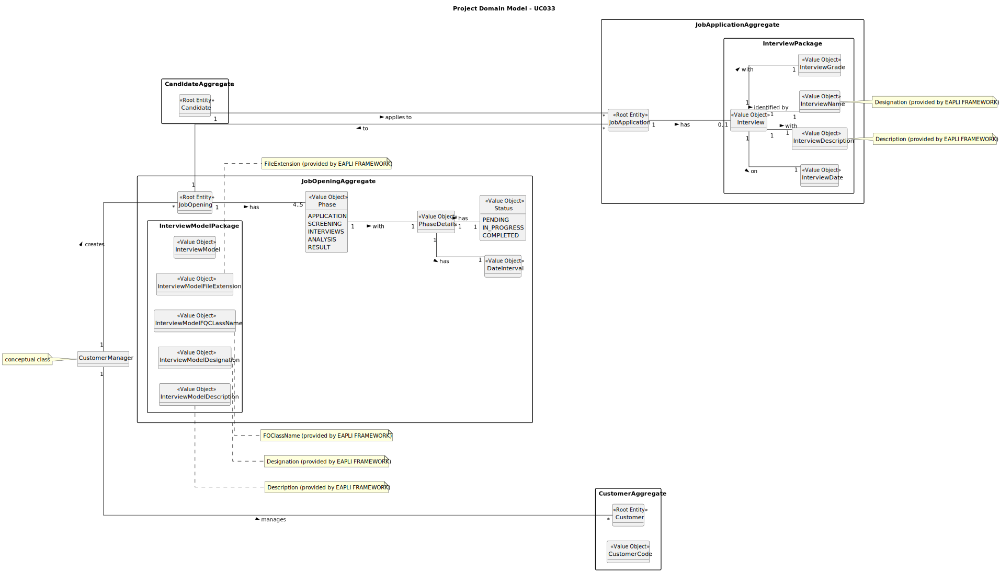

# UC033 - As Customer Manager, I want to get an ordered list of candidates, using the job interview points (grades), to help me analyze the candidates.

## 2. Analysis

### 2.1. Relevant Domain Model Excerpt

### 2.2. Process Specification

#### 2.2.1. Normal Flow
1. **Authenticate Customer Manager**: Verify that the Customer Manager is logged in with appropriate permissions.
2. **Access User Management Interface**: Customer Manager navigates to the user management section of the backoffice.
3. **Select Job Opening**: Customer Manager selects one job opening from available options.
4. **Confirmation to Customer Manager**: Display job opening's interview grades or error messages if any step fails.

#### 2.2.2. Exceptional Flows
- **EF033.1**: If there is a system error while obtaining data, notify the Customer Manager of the failure and suggest retrying.
- **EF033.2**: If there are no job openings with interviews or in the analysis phase, notify the Customer Manager that the operation is not possible at the moment.
- **EF033.3**: If there are no interviews for the selected job opening, notify the Customer Manager that the operation is not possible for that job opening, at the moment.

### 2.3. Functional Requirements Reevaluation
- **FR033.1**: The system shall allow the Customer Manager to access the list of candidates with their respective interview grades for a specific job opening.
- **FR033.2**: The system shall display an error message if the Customer Manager attempts to access the list of candidates for a job opening without interviews.
- **FR033.3**: The system shall display a message if there are no interviews for the selected job opening.

### 2.4. Non-functional Requirements Specification
- **Security**: Assess encryption standards for storing and transmitting user credentials.
- **Performance**: Ensure user registration processes complete within acceptable time limits, maintaining system responsiveness.
- **Usability**: Interface should be intuitive, guiding the Customer Manager smoothly through the registration process with clear instructions and error handling.

### 2.5. Data Integrity and Security
- Outline the security measures for data handling, particularly how personal data is protected in line with compliance requirements (e.g., GDPR).
- Detail encryption methods for password storage and secure transmission mechanisms for sensitive data.

### 2.6. Interface Design
- The interface will follow the EAPLI framework's design patterns, providing a user-friendly experience for the Admin.

### 2.7. Risk Analysis
- **R033.1**: Unauthorized Access to Job Openings Data
  - **Mitigation**: Implement secure encryption standards for storing and transmitting user credentials to prevent unauthorized access.

### 2.8. Decisions
- **D033.1**: Every job opening must have at least one interview to be considered for the list of job openings.
- **D033.2**: Every job application must have an interview grade to be considered for the list of grades to be displayed.