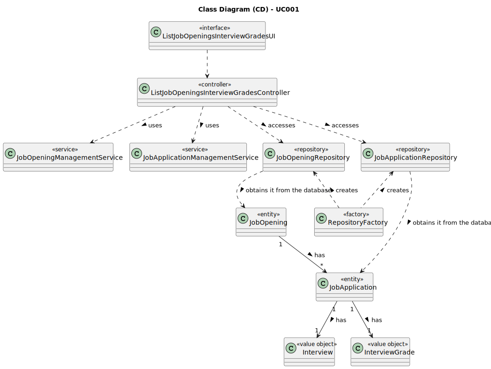

# UC001 - As Admin, I want to register users of the backoffice

## 3. Design - Use Case Realization

### 3.1. Rationale

| Interaction ID                                                                       | Question: Which class is responsible for...             | Answer                          | Justification (with patterns)                                                                                                      |
|:-------------------------------------------------------------------------------------|:--------------------------------------------------------|:--------------------------------|:-----------------------------------------------------------------------------------------------------------------------------------|
| Step 1: Login (as Customer Manager)                                                  | ... running the application's console?                  | BaseApplication                 | Pure Fabrication: BaseApplication is a class created with the purpose of running a console in our application.                     |
|                                                                                      | ... showing the backoffice console to do login?         | BaseBackoffice                  | Pure Fabrication: BaseBackoffice is a class created with the purpose of showing the backoffice console.                            |
|                                                                                      | ... showing the login menu?                             | LoginUI                         | Pure Fabrication: LoginUI is a class created with the purpose of showing the login menu.                                           |
| Step 2: Validate login (as Customer Manager)                                         | ... validating the login credentials?                   | CredentialHandler               | Service: CredentialHandler is a class that provides the service of validating login credentials.                                   |
|                                                                                      | ... showing the login (in)success message?              | LoginUI                         | Pure Fabrication: LoginUI is a class created with the purpose of showing the login success message.                                |
| Step 3: Allow access to the backoffice application with Customer Manager permissions | ... giving customer manager permissions to logged user? | CredentialHandler               | Service: CredentialHandler is a class that provides the service of validating login credentials.                                   |
| Step 4: Obtaining all job openings with phase interview                              | ... obtaining all job openings?                         | JobOpeningRepository            | Repository: JobOpeningRepository is a class that provides the service of obtaining all job openings.                               |
|                                                                                      | ... filtering job openings with phase interview?        | JobOpeningManagementService     | Service: JobOpeningManagementService is a class that provides the service of filtering job openings with phase interview.          |
| Step 5: Selecting job openings with phase interview                                  | ... displaying job openings?                            | ListJobOpeningsInterviewsUI     | Pure Fabrication: ListJobOpeningsInterviewsUI is a class created with the purpose of displaying job openings.                      |
|                                                                                      | ... selecting a job opening?                            | ListJobOpeningsInterviewsUI     | Pure Fabrication: ListJobOpeningsInterviewsUI is a class created with the purpose of selecting a job opening.                      |
| Step 6: Obtaining all job applications with interview grades                         | ... obtaining all job openings?                         | JobApplicationRepository        | Repository: JobApplicationRepository is a class that provides the service of obtaining all candidates.                             |
|                                                                                      | ... filtering job applications with interview grades?   | JobApplicationManagementService | Service: JobApplicationManagementService is a class that provides the service of filtering job applications with interview grades. |
| Step 7: Displaying job applications with interview grades                            | ... displaying job applications?                        | ListJobOpeningsInterviewsUI     | Pure Fabrication: ListJobOpeningsInterviewsUI is a class created with the purpose of displaying job applications.                  |

### Systematization ##

According to the taken rationale, the conceptual classes promoted to software classes are:

n/a

Other software classes (i.e. Pure Fabrication) identified:

* BaseApplication
* BaseBackoffice
* ListJobOpeningsInterviewsUI
* ListJobOpeningsInterviewsController
* JobOpeningRepository
* JobApplicationRepository
* CredentialHandler
* AuthorizationService
* JobOpeningService
* JobApplicationService

## 3.2. Sequence Diagram (SD)

## 3.3. Class Diagram (CD)

