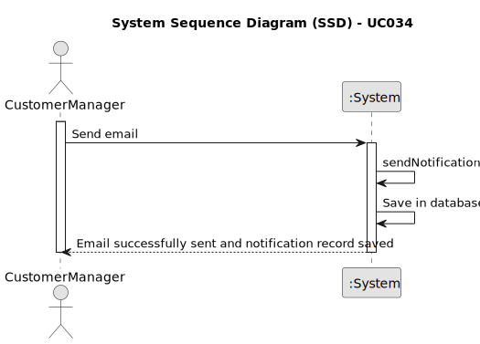

# UC034 -  As Customer Manager, I want to publish the results of the selection of candidates for a job opening, so that candidates and customer are notified by email of the result.

## 1. Requirements Engineering

### 1.1. Use Case Description

> As Customer Manager, I want to publish the results of the selection of candidates for a job opening, so that candidates and customer are notified by email of the result.

---

### 1.2. Customer Specifications and Clarifications

**From the specifications document:**

- The solution should be deployed using several network nodes. It is expected that, at least, the relational
  database server and the Follow Up Server be deployed in nodes diferent from localhost, preferably in the cloud. The e-mail notification
  tasks must be executed in background by the Follow Up Server.

**From the client clarifications:**

> **Question:** ...relativamente ao envio das notificações por email, é necessário guardar que esse envio foi feito?
> 
> **Answer:** No documento nada de explicito é dito sobre este assunto. No entanto, do ponto de vista de gestão do processo da jobs4u parece-me adequado que essa informação fique registada.
> 
> **Question:** Qual é o formato para essa publicação?
> 
> **Answer:** A publicação refere-se a informar os candidatos e o cliente, por email. Os candidatos que são selecionados devem receber um email a indicar que para a sua candidatura ao job opening foram selecionados e irão ser contactados pela empresa. No que se refere à empresa, esta deve receber um email com a lista dos candidatos selecionados que deve incluir o nome e dados de contacto do candidato.
> 
> **Question:** Regarding the selection of candidates, should we assume that the first N candidates in the ranking (where N is the number of job vacancies) are chosen, or should we allow the customer manager to select the N candidates?
> 
> **Answer:** The first option (using the results from US1013).
> 
> **Question:** Esta US pede que seja publicado os resultados das candidaturas, a minha pergunta seria se este processo só pode acontecer quando a job opening estiver encerrada ou se executar esta operação terminaria a job opening.
> 
> **Answer:** Esta US é relativa à última fase do processo. Se as notificações executarem todas com sucesso em princípio já não existe mais nada a fazer neste processo.
---

### 1.3. Acceptance Criteria

> **AC034.1**: The system must notify the selected candidates by email about their selection.
> **AC034.2**: The system must notify the customer by email with the list of selected candidates and their contact details.
> **AC034.3**: The system must record that the notification has been made.
> **AC034.4**: The system must provide feedback to the Customer Manager on the success or failure of the notification process.
---

### 1.4. Found out Dependencies

* This Use Case is relative to US 1013, which is related to the selection and ranking of candidates.
* It relates to the following Use Cases as well:
  - [UC033](../../UC002/README.md) - As Customer Manager, I want to get an ordered list of candidates, using the job
	interview points (grades), to help me analyze the candidates.

### 1.5 Input and Output Data

**Input Data:**

- Automatic data:
	- send email

**Output Data:**
- Send email with the result of the selection of candidates

### 1.6. System Sequence Diagram (SSD)

### 1.7 Other Relevant Remarks

- The email notification functionality depends on the system's ability to authenticate users and manage job openings and candidate data appropriately.