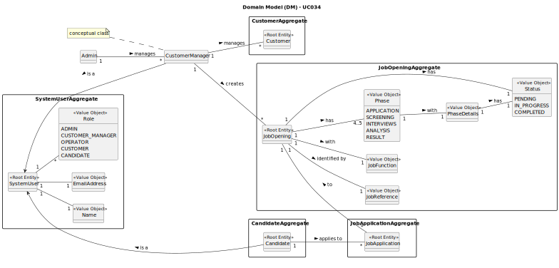

# UC034 -  As Customer Manager, I want to publish the results of the selection of candidates for a job opening, so that candidates and customer are notified by email of the result.

## 2. Analysis

### 2.1. Relevant Domain Model Excerpt

The following diagram was extracted from the EAPLI framework (provided by the course's teachers).

### 2.2. Process Specification

#### 2.2.1. Normal Flow
1. **Publish Results**: The Customer Manager publishes the results of the selection process.
2. **Notify Candidates**: The system sends an email to the selected candidates informing them of their selection and providing further instructions.
3. **Notify Customer**: The system sends an email to the customer with the list of selected candidates and their contact details.
4. **Record Notification**: The system records that the notification has been made for process management purposes.
5. **Feedback**: The system provides feedback to the Customer Manager on the success or failure of the operation.

#### 2.2.2. Exceptional Flows
- **EF034.1**: If the email is not sent, the system must notify the Customer Manager and log the error.

### 2.3. Functional Requirements Reevaluation
- **FR034.1**: The system shall allow the Customer Manager to publish the results of the selection process for a specific job opening.
- **FR034.2**: The system shall notify the selected candidates by email about their selection.
- **FR034.3**: The system shall notify the customer by email with the list of selected candidates and their contact details.
- **FR034.4**: The system shall record that the notification has been made.
- **FR034.5**: The system shall provide feedback to the Customer Manager on the success or failure of the notification process.

### 2.4. Non-functional Requirements Specification
- **Security**: Implement access control mechanisms to ensure that only authorized Customer Managers can publish results and send notifications.
- **Performance**: Ensure that the notification process is completed within acceptable time limits to maintain system responsiveness.
- **Usability**: The interface should be intuitive, guiding the Customer Manager smoothly through the process of publishing results and sending notifications with clear instructions and error handling.

### 2.5. Data Integrity and Security
- Data integrity measures should ensure that the publication of results and notifications are accurately recorded and reflected in the system without compromising data consistency.
- Security measures should prevent unauthorized access to the functionality of publishing results and sending notifications and protect sensitive job opening data.

### 2.6. Interface Design
- The interface should provide an intuitive and efficient workflow for selecting and publishing results of job openings, with clear indications of success or failure and actions for notifications.

### 2.7. Risk Analysis
- **R034.1**: System Error During Publication or Notification
    - **Mitigation**: Implement error handling mechanisms to notify the Customer Manager of any system failures and provide guidance on how to proceed.
  
### 2.8. Decisions
- **D034.1**: Use role-based access control for the functionality of publishing results and sending notifications, restricting access to authorized Customer Managers only.
- **D034.2**: Use the provided domain model as a reference for implementing the functionality of publishing results and sending notifications.
- **D034.3**: Utilize the system's email notification service to send updates to candidates and customers.
- **D034.4**: Implement a logging mechanism to record the success or failure of email notifications for audit purposes.